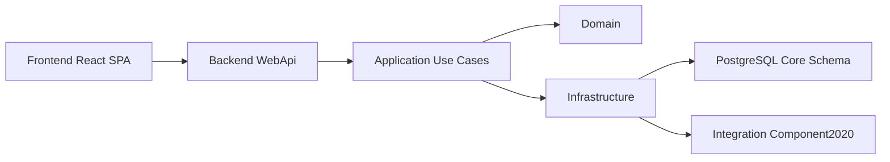

# MyIS — краткое описание и целевая картина

## 1. Назначение и контекст

MyIS — модульная информационная система (модульный монолит) для обособленного подразделения, занимающегося разработкой и мелкосерийным производством СВЧ‑модулей.

Основные цели (сокращённо по концепции из [`00_Концепция_системы.md`](Doc/00_Концепция_системы.md)):

- поэтапно заменить функции Компонент‑2020 без остановки текущей деятельности;
- повысить управляемость и прозрачность процессов по заявкам, закупке, производству, складу, инженерному и технологическому контурам;
- дать единую основу для диспетчеризации и аналитики по подразделению.

Система строится как **модульный монолит**:

- одно backend‑приложение на .NET;
- одна основная БД PostgreSQL;
- чётко выделенные доменные модули с собственными сущностями и границами.

Компонент‑2020 рассматривается как внешняя система (источник/приёмник данных) с поэтапным переносом владения данными в MyIS.

Высокоуровневая архитектура и правила по слоям формально зафиксированы в:

- [`Coding_Guidelines_MyIS.md`](.kilocode/rules/Coding_Guidelines_MyIS.md);
- [`MyIS_Architecture_Core_Requirements.md`](.kilocode/rules/MyIS_Architecture_Core_Requirements.md).

Этот файл даёт ИИ сжатый ментальный снимок системы и этапов её развития.

## 2. Основные доменные модули

Планируемые домены (по гл. 5 в [`00_Концепция_системы.md`](Doc/00_Концепция_системы.md)):

- **Requests** — управление всеми типами заявок; единый входной контур, связывающий заявки с заказами клиентов, закупкой, производством и складом; статусы, согласования, история.
- **Customers** — клиенты и заказы клиентов; статусы исполнения заказов, связь с заявками и производственными заказами.
- **Engineering** — изделия, ревизии/версии, спецификации (BOM), конструкторская документация и файлы САПР.
- **Technology** — маршруты и технологические операции, нормы времени, технологические инструкции и карты процессов.
- **Production** — производственные заказы и партии, статусы прохождения стадий, укрупнённое планирование и диспетчеризация производства.
- **Procurement** — закупка: обработка заявок на обеспечение/закупку, коммерческие предложения и счета, заказы поставщикам и их статусы.
- **Warehouse** — склады, ячейки, остатки, резервы и движения.
- **Integration.Component2020** — интеграция с Компонент‑2020: чтение справочников и заказов, запись заказов поставщикам и производственных заказов по мере миграции.

Каждый модуль владеет своими сущностями и таблицами; другие модули взаимодействуют с ним только через публичные контракты Application‑слоя (Use Case, интерфейсы сервисов).

## 3. Этапы проекта и текущий статус

Этапность (см. разд. 3.3 в [`00_Концепция_системы.md`](Doc/00_Концепция_системы.md)):

1. **Этап 1 — Requests и базовая интеграция**
   - модуль Requests как единый входной контур заявок;
   - базовый обмен с Компонент‑2020 (справочники, заказы, упрощённые заказы поставщикам).
2. **Этап 2 — Customers и Procurement**
   - управление заказами клиентов и закупочной деятельностью в MyIS;
   - Компонент‑2020 остаётся в роли учётного слоя.
3. **Этап 3 — Production и Warehouse**
   - перенос производственного и складского контура;
   - внедрение оперативной диспетчеризации.
4. **Этап 4 — Engineering, Technology и аналитика**
   - перенос инженерных и технологических данных;
   - расширенная аналитика и минимизация роли Компонент‑2020.

Фактическое состояние после Этапа 0 описано в [`Описание состояния после Этап 0.md`](Doc/Описание состояния после Этап 0.md). Вкратце:

- реализован каркас backend (Domain/Application/Infrastructure/WebApi) с пользователями и ролями, Auth, инфраструктурой подключения к PostgreSQL и Admin DB API;
- реализован каркас frontend (React + TypeScript + Vite + Ant Design + React Router) с App Shell, страницами Login и DB Setup, guard’ами DbStatusGuard и RequireAuth;
- реализована автоматическая инициализация администратора через EF‑миграцию (Admin/admin, роль ADMIN и связь).

Этап 1 (Requests) пока не реализован в коде, но детально специфицирован в [`20_ТЗ_Этап1_Requests.md`](Doc/20_ТЗ_Этап1_Requests.md).

## 4. Высокоуровневый поток запросов

Логический поток для пользовательского запроса:

Ключевые моменты:

- Frontend обращается к REST API (`/api/...`) через WebApi;
- WebApi не содержит бизнес‑логики, только маппинг HTTP ↔ DTO и вызов Use Case;
- Application реализует Use Case как единственную точку изменения состояния;
- Domain содержит только предметную модель (entities, value objects, domain services);
- Infrastructure реализует доступ к PostgreSQL и внешним системам (Компонент‑2020 и др.).

## 5. Что уже можно считать «стабильным каркасом»

С учётом Этапа 0 (см. [`Описание состояния после Этап 0.md`](Doc/Описание состояния после Этап 0.md)) стабильным и опорным для последующей разработки считаем:

- слоистую архитектуру backend (Domain/Application/Infrastructure/WebApi) и их границы;
- модель users/roles/user_roles и базовый Auth‑контур (login/me/logout, cookie `.MyIS.Auth`);
- инфраструктуру настройки БД (Admin DB API + UI DB Setup) и политику «приложение стартует даже без строки подключения»;
- App Shell на фронтенде, базовую маршрутизацию и guard’ы DbStatusGuard и RequireAuth.

Все новые функции (начиная с модуля Requests) должны проектироваться и реализовываться, строго опираясь на этот каркас и архитектурные правила из `.kilocode/rules`.