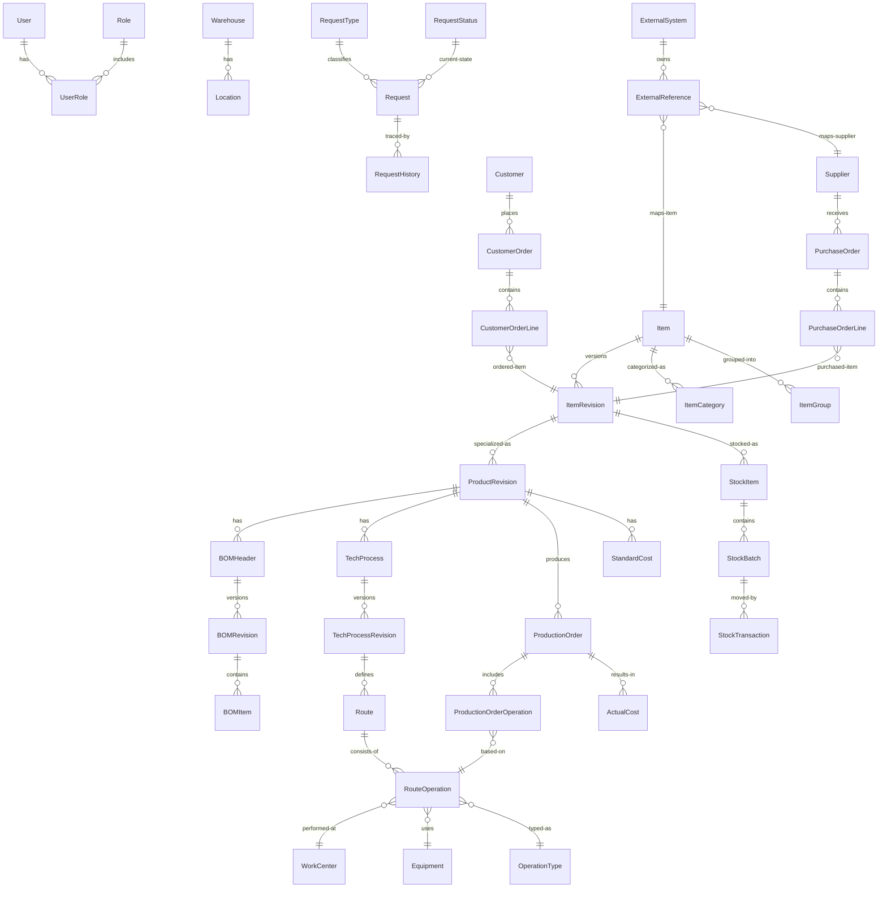

# MyIS — Общая концептуальная модель данных (v0.3)

> Документ объединяет концептуальную модель данных MyIS (v0.2) и уточнённую детализацию ключевых сущностей с полями (v0.3). Предназначен для архитекторов, разработчиков и ИИ-агентов (Kilo Code и др.), работающих с кодом MyIS.

---

## 1. Назначение документа

Документ определяет **целевую концептуальную модель данных** системы MyIS и базовый набор сущностей с полями. Используется для:

- проектирования архитектуры и слоёв (Domain / Application / Infrastructure / WebApi);
- проектирования модулей (PDM/Engineering, Technology, Requests, Warehouse и т.д.);
- согласования структуры БД и EF Core-моделей;
- настройки ИИ-агентов (например, Kilo Code) на работу по архитектуре MyIS;
- формирования требований для последующих ТЗ (Этапы 1+).

Документ описывает:

- домены и их схемы в PostgreSQL;
- сущности и связи на концептуальном уровне;
- ключевые поля основных сущностей;
- правила владения данными, версионности, измерений и статусов.

Этот документ **не является исчерпывающей физической схемой БД**, но служит эталоном для её построения и эволюции.

---

## 2. Архитектурные принципы модели данных

### 2.1. Одна БД, схемы по доменам

Используется одна БД PostgreSQL, например:

```text
Database: myis_db
```

Каждый домен имеет **свою схему**:

```text
core          – пользователи, роли, атрибуты, UoM
mdm           – номенклатура и классификация
engineering   – изделия, BOM, КД, ревизии
technology    – ТП, маршруты, операции
warehouse     – склады, партии, остатки, движения
requests      – заявки, статусы, workflow
customers     – клиенты и их данные
production    – производственные заказы, WIP
procurement   – закупки, поставщики
costing       – себестоимость, трудозатраты
integration   – внешние системы, Компонент-2020 и др.
public        – служебные таблицы EF Core (migrations)
```

### 2.2. Фиксированные домены

Список доменов **фиксирован** и не меняется. Внутри доменов можно добавлять новые сущности, но:

- домены не объединяются;
- домены не дробятся на новые;
- логика владения сущностями остаётся стабильной.

### 2.3. Владелец данных

Каждая сущность имеет единственного **домен-владельца**. Только этот домен:

- создаёт/изменяет/удаляет записи;
- определяет бизнес-правила и политики.

Другие домены могут:

- ссылаться на сущность по ключам;
- читать данные через Application-слой;
- не нарушать инварианты чужого домена.

### 2.4. Идентификаторы

Базовое правило:

- `Guid Id` — суррогатный первичный ключ;
- при необходимости — дополнительный человекочитаемый `Code` (string).

### 2.5. Версионность

Версионность применяется для сущностей, связанных с жизненным циклом изделия и процессов:

- `ItemRevision`
- `ProductRevision`
- `BOMRevision`
- `TechProcessRevision`

Общие принципы:

- ревизия неизменяема (кроме статуса);
- все изменения оформляются новой ревизией;
- статусы: `Draft`, `Approved`, `Released`, `Obsolete` (минимальный набор);
- у ревизии могут быть даты действия (EffectiveFrom / EffectiveTo).

### 2.6. Измерения и количество

Используется VO:

```csharp
public readonly record struct Quantity(
    decimal Value,
    string UnitCode // ссылка на core.UnitOfMeasure.Code
);
```

В модели данных это реализуется полями `Value` + `UoMId` / `UoMCode`.

### 2.7. Статусы и workflow

Статусы не хранятся в виде «произвольных строк». Используются:

- справочники статусов (например, `RequestStatus`, `RevisionStatus`);
- enum/VO в коде для маппинга.

Переходы между статусами реализуются в Application-слое (use case / handler), а не в контроллерах или напрямую в EF.

### 2.8. Атрибуты (расширяемость)

Для расширения сущностей используется механизм атрибутов:

- `core.AttributeDefinition`
- `core.AttributeGroup`
- `core.AttributeValue`
- `core.ObjectAttributeValue`

Позволяет добавлять новые свойства без миграции схемы для каждого домена.

---

## 3. Домены и области ответственности

### 3.1. core

Схема: `core`

Сущности (концептуально):

- `User`, `Role`, `Permission`, `UserRole`
- `UnitOfMeasure`, `Currency`
- `Document` (файлы)
- `AttributeDefinition`, `AttributeGroup`, `AttributeValue`, `ObjectAttributeValue`

Назначение: общесистемное ядро — пользователи, роли, измерения, атрибуты, файлы.

---

### 3.2. mdm (Master Data)

Схема: `mdm`

Сущности:

- `Item` — номенклатура (компоненты, изделия, материалы, услуги)
- `ItemRevision` — ревизия номенклатуры/изделия (для PDM)
- `ItemCategory`, `ItemGroup`
- `Manufacturer`
- (опционально) базовый `Supplier` / `Customer` – могут быть вынесены в `procurement`/`customers`

Назначение: единый источник правды по номенклатуре и классификации.

---

### 3.3. engineering (PDM / КД / BOM)

Схема: `engineering`

Сущности:

- `Product` — изделие (модель прибора/узла), часто 1:1 к Item для изделий
- `ProductRevision` — ревизия изделия (link к `mdm.ItemRevision` или отдельная сущность)
- `BOMHeader` — заголовок спецификации
- `BOMRevision` — ревизия спецификации
- `BOMItem` — строка спецификации
- `DesignDocument`, `DesignDocumentRevision`, связи с ProductRevision

Назначение: управление структурой изделий и конструкторской документацией.

---

### 3.4. technology (ТП/маршруты/операции)

Схема: `technology`

Сущности:

- `TechProcess`, `TechProcessRevision`
- `Route`, `RouteOperation`
- `OperationType`
- `WorkCenter`
- `Equipment`
- `TechDocument`, `TechDocumentRevision`

Назначение: ТП для приборостроения (монтаж, сборка, настройка, испытания), маршруты и операции.

---

### 3.5. warehouse (склад)

Схема: `warehouse`

Сущности:

- `Warehouse`
- `Location`
- `StockItem`
- `StockBatch`
- `StockTransaction`
- `InventoryDocument`, `InventoryLine`

Назначение: учёт остатков, партий, движений и инвентаризаций.

---

### 3.6. requests (заявки)

Схема: `requests`

Сущности:

- `Request`
- `RequestType`
- `RequestStatus`
- `RequestWorkflow`
- `RequestComment`
- `RequestAttachment`
- `RequestHistory`

Назначение: единый каркас заявок и процессов (Этап 1 и далее).

---

### 3.7. customers

Схема: `customers`

Сущности:

- `Customer`
- `CustomerContact`
- `CustomerOrder`
- `CustomerOrderLine`

Назначение: клиенты и их заказы.

---

### 3.8. production

Схема: `production`

Сущности:

- `ProductionOrder`
- `ProductionOrderOperation`
- `WIPRecord`
- `ProductionBatch`

Назначение: производственные заказы и ход выполнения.

---

### 3.9. procurement

Схема: `procurement`

Сущности:

- `Supplier`
- `PurchaseOrder`
- `PurchaseOrderLine`
- `SupplierContract`

Назначение: закупки и поставщики.

---

### 3.10. costing

Схема: `costing`

Сущности:

- `CostElement`
- `StandardCost`
- `ActualCost`
- `LaborRate`
- `WorkTimeLog`

Назначение: расчёт себестоимости и учёт трудозатрат.

---

### 3.11. integration

Схема: `integration`

Сущности:

- `ExternalSystem`
- `ExternalReference`
- `SyncQueue`
- `SyncLog`

Назначение: интеграция с Компонент-2020 и другими внешними системами.

---

## 4. Глобальная ER-диаграмма доменов (Mermaid)



---

## 5. Детализация ключевых сущностей (v0.3)

Ниже приведена детализация основных сущностей с полями. Типы даны концептуально (C#-ориентированные). На физическом уровне они будут отображены в EF Core и PostgreSQL.

### 5.1. core

#### 5.1.1. `core.User`

| Поле       | Тип            | Обяз. | Описание |
|-----------|----------------|-------|----------|
| Id        | Guid           | ✔     | Идентификатор пользователя |
| UserName  | string         | ✔     | Логин |
| FullName  | string         | ✔     | Полное имя |
| Email     | string         | ✔     | E-mail |
| IsActive  | bool           | ✔     | Признак активности |
| CreatedAt | DateTime       | ✔     | Дата создания |
| CreatedBy | Guid           | ✔     | Кто создал |
| UpdatedAt | DateTime?      |       | Дата изменения |
| UpdatedBy | Guid?          |       | Кто изменил |

#### 5.1.2. `core.Role`

| Поле      | Тип    | Обяз. | Описание |
|----------|--------|-------|----------|
| Id       | Guid   | ✔     | Идентификатор роли |
| Code     | string | ✔     | Уникальный код (ADMIN, ENGINEER, …) |
| Name     | string | ✔     | Название |
| IsSystem | bool   | ✔     | Системная роль (нельзя удалять) |

#### 5.1.3. `core.UnitOfMeasure`

| Поле      | Тип    | Обяз. | Описание |
|----------|--------|-------|----------|
| Id       | Guid   | ✔     | Идентификатор |
| Code     | string | ✔     | Код (шт, м, кг, час…) |
| Name     | string | ✔     | Название |
| Dimension| string |       | Измеряемая величина (length, mass, time…) |

---

### 5.2. mdm

#### 5.2.1. `mdm.Item`

| Поле       | Тип      | Обяз. | Описание |
|-----------|----------|-------|----------|
| Id        | Guid     | ✔     | Идентификатор |
| Code      | string   | ✔     | Код номенклатуры |
| Name      | string   | ✔     | Наименование |
| ItemType  | string   | ✔     | Тип (Component, Material, Assembly, FinishedProduct, Service…) |
| DefaultUoMId | Guid  | ✔     | Ссылка на core.UnitOfMeasure |
| IsStocked | bool     | ✔     | Учитывается на складе |
| IsActive  | bool     | ✔     | Признак активности |

#### 5.2.2. `mdm.ItemRevision`

| Поле           | Тип      | Обяз. | Описание |
|---------------|----------|-------|----------|
| Id            | Guid     | ✔     | Идентификатор ревизии |
| ItemId        | Guid     | ✔     | Ссылка на Item |
| RevisionCode  | string   | ✔     | Обозначение ревизии (A, B, 01…) |
| Status        | string   | ✔     | Статус (Draft, Approved, Released, Obsolete) |
| EffectiveFrom | DateTime |       | Дата начала действия |
| EffectiveTo   | DateTime?|       | Дата окончания действия |
| CreatedAt     | DateTime | ✔     | Дата создания |
| CreatedBy     | Guid     | ✔     | Автор |

---

### 5.3. engineering

#### 5.3.1. `engineering.Product`

| Поле   | Тип  | Обяз. | Описание |
|--------|------|-------|----------|
| Id     | Guid | ✔     | Идентификатор изделия |
| ItemId | Guid | ✔     | Ссылка на mdm.Item (для изделий типа FinishedProduct/Assembly) |

#### 5.3.2. `engineering.ProductRevision`

| Поле          | Тип    | Обяз. | Описание |
|---------------|--------|-------|----------|
| Id            | Guid   | ✔     | Идентификатор ревизии изделия |
| ProductId     | Guid   | ✔     | Ссылка на Product |
| ItemRevisionId| Guid   | ✔     | Связь с mdm.ItemRevision (если используется единая модель) |
| RevisionCode  | string | ✔     | Код ревизии |
| Status        | string | ✔     | Статус ревизии |
| CreatedAt     | DateTime | ✔   | Дата создания |
| CreatedBy     | Guid   | ✔     | Автор |

#### 5.3.3. `engineering.BOMHeader`

| Поле             | Тип    | Обяз. | Описание |
|------------------|--------|-------|----------|
| Id               | Guid   | ✔     | Идентификатор спецификации |
| ProductRevisionId| Guid   | ✔     | Ссылка на ProductRevision |
| Code             | string | ✔     | Код/обозначение спецификации |
| Name             | string | ✔     | Наименование |

#### 5.3.4. `engineering.BOMRevision`

| Поле        | Тип      | Обяз. | Описание |
|------------|----------|-------|----------|
| Id         | Guid     | ✔     | Идентификатор ревизии спецификации |
| BOMHeaderId| Guid     | ✔     | Ссылка на BOMHeader |
| RevisionCode | string | ✔     | Код ревизии |
| Status     | string   | ✔     | Статус |
| CreatedAt  | DateTime | ✔     | Дата создания |
| CreatedBy  | Guid     | ✔     | Автор |

#### 5.3.5. `engineering.BOMItem`

| Поле         | Тип      | Обяз. | Описание |
|-------------|----------|-------|----------|
| Id          | Guid     | ✔     | Идентификатор строки |
| BOMRevisionId | Guid   | ✔     | Ссылка на BOMRevision |
| ComponentItemRevisionId | Guid | ✔ | Ссылка на mdm.ItemRevision (компонент/узел) |
| QuantityValue | decimal| ✔     | Количество |
| QuantityUoMId | Guid   | ✔     | Единица измерения |
| IsOptional  | bool     |       | Необязательный компонент |
| Notes       | string   |       | Примечания |

---

### 5.4. technology

#### 5.4.1. `technology.TechProcess`

| Поле         | Тип  | Обяз. | Описание |
|--------------|------|-------|----------|
| Id           | Guid | ✔     | Идентификатор ТП |
| ProductRevisionId | Guid | ✔ | Ссылка на ProductRevision |

#### 5.4.2. `technology.TechProcessRevision`

| Поле          | Тип      | Обяз. | Описание |
|---------------|----------|-------|----------|
| Id            | Guid     | ✔     | Идентификатор ревизии ТП |
| TechProcessId | Guid     | ✔     | Ссылка на TechProcess |
| RevisionCode  | string   | ✔     | Код ревизии |
| Status        | string   | ✔     | Статус |
| CreatedAt     | DateTime | ✔     | Дата создания |
| CreatedBy     | Guid     | ✔     | Автор |

#### 5.4.3. `technology.Route`

| Поле                 | Тип      | Обяз. | Описание |
|----------------------|----------|-------|----------|
| Id                   | Guid     | ✔     | Идентификатор маршрута |
| TechProcessRevisionId| Guid     | ✔     | Ссылка на TechProcessRevision |
| Name                 | string   | ✔     | Наименование маршрута |

#### 5.4.4. `technology.RouteOperation`

| Поле           | Тип      | Обяз. | Описание |
|----------------|----------|-------|----------|
| Id             | Guid     | ✔     | Идентификатор операции в маршруте |
| RouteId        | Guid     | ✔     | Ссылка на Route |
| Sequence       | int      | ✔     | Порядковый номер |
| OperationTypeId| Guid     | ✔     | Тип операции |
| WorkCenterId   | Guid     | ✔     | Рабочее место |
| EquipmentId    | Guid?    |       | Оборудование (если фиксировано) |
| PlannedDurationMinutes | decimal |       | Плановое время, мин |

#### 5.4.5. `technology.WorkCenter`

| Поле      | Тип    | Обяз. | Описание |
|----------|--------|-------|----------|
| Id       | Guid   | ✔     | Идентификатор |
| Code     | string | ✔     | Код |
| Name     | string | ✔     | Наименование |
| DepartmentId | Guid? |     | Привязка к подразделению (core/Org) |

#### 5.4.6. `technology.Equipment`

| Поле      | Тип    | Обяз. | Описание |
|----------|--------|-------|----------|
| Id       | Guid   | ✔     | Идентификатор |
| Code     | string | ✔     | Инвентарный/заводской номер |
| Name     | string | ✔     | Наименование |
| WorkCenterId | Guid? |     | Основное место эксплуатации |

---

### 5.5. warehouse

#### 5.5.1. `warehouse.Warehouse`

| Поле  | Тип    | Обяз. | Описание |
|-------|--------|-------|----------|
| Id    | Guid   | ✔     | Идентификатор склада |
| Code  | string | ✔     | Код |
| Name  | string | ✔     | Название |

#### 5.5.2. `warehouse.Location`

| Поле        | Тип    | Обяз. | Описание |
|------------|--------|-------|----------|
| Id         | Guid   | ✔     | Идентификатор ячейки/зоны |
| WarehouseId| Guid   | ✔     | Ссылка на Warehouse |
| Code       | string | ✔     | Код (ряд/секция/ячейка) |
| Name       | string |       | Описание |

#### 5.5.3. `warehouse.StockItem`

| Поле          | Тип    | Обяз. | Описание |
|---------------|--------|-------|----------|
| Id            | Guid   | ✔     | Идентификатор записи по запасам |
| ItemRevisionId| Guid   | ✔     | Ссылка на mdm.ItemRevision |
| WarehouseId   | Guid   | ✔     | Ссылка на Warehouse |
| QuantityValue | decimal| ✔     | Количество |
| QuantityUoMId | Guid   | ✔     | UoM |

#### 5.5.4. `warehouse.StockBatch`

| Поле          | Тип    | Обяз. | Описание |
|---------------|--------|-------|----------|
| Id            | Guid   | ✔     | Идентификатор партии |
| StockItemId   | Guid   | ✔     | Ссылка на StockItem |
| BatchNumber   | string |       | Номер партии |
| SerialNumber  | string |       | Серийный номер (для штучных изделий) |
| ProductionDate| DateTime?|     | Дата производства |

---

### 5.6. requests

#### 5.6.1. `requests.Request`

| Поле         | Тип      | Обяз. | Описание |
|--------------|----------|-------|----------|
| Id           | Guid     | ✔     | Идентификатор заявки |
| RequestTypeId| Guid     | ✔     | Тип заявки |
| StatusId     | Guid     | ✔     | Текущий статус |
| Title        | string   | ✔     | Краткое описание |
| Description  | string   |       | Подробное описание |
| CreatedBy    | Guid     | ✔     | Автор |
| CreatedAt    | DateTime | ✔     | Дата создания |
| DueDate      | DateTime?|       | Желаемый срок |
| RelatedEntityType | string |    | Тип связанной сущности (опционально) |
| RelatedEntityId   | Guid? |     | Id связанной сущности |

#### 5.6.2. `requests.RequestType`

| Поле | Тип    | Обяз. | Описание |
|------|--------|-------|----------|
| Id   | Guid   | ✔     | Идентификатор |
| Code | string | ✔     | Код (ECR, ECO, PURCH, PROD, BUG, …) |
| Name | string | ✔     | Название |

#### 5.6.3. `requests.RequestStatus`

| Поле | Тип    | Обяз. | Описание |
|------|--------|-------|----------|
| Id   | Guid   | ✔     | Идентификатор |
| Code | string | ✔     | Код (NEW, IN_PROGRESS, APPROVED, REJECTED, CLOSED) |
| Name | string | ✔     | Название |

---

## 6. Связь с правилами проектирования кода MyIS

Для того, чтобы данная модель данных использовалась **и в документации, и ИИ-агентами (Kilo Code)**, необходимо:

1. **Положить данный файл в репозиторий**, например:  
   `Doc/MyIS_Conceptual_Data_Model_v0.3.md`

2. В документе **«Правила проектирования кода MyIS»** добавить раздел:

   > ### Архитектура данных MyIS  
   > - Все новые сущности и изменения в моделях данных должны соответствовать документу `MyIS_Conceptual_Data_Model_v0.3.md`.  
   > - Домены, схемы и владение данными фиксированы. Добавление новой сущности должно сопровождаться указанием домена и схемы.  
   > - Запрещено создавать сущности и таблицы, дублирующие функциональность уже описанных в модели данных.  
   > - Любая новая бизнес-функция сначала описывается через существующие сущности (Item / ItemRevision / ProductRevision / BOM / TechProcess / Request и т.д.), а затем реализуется в коде.

3. В настройках **Kilo Code** (или другого ИИ-агента) использовать следующий фрагмент в системном/проектном промпте:

   > Ты работаешь в проекте MyIS (многослойная система для приборостроения).  
   > Основой для всех моделей данных является документ `Doc/MyIS_Conceptual_Data_Model_v0.3.md`.  
   > - Всегда проверяй, к какому домену относится новая сущность (core, mdm, engineering, technology, warehouse, requests, customers, production, procurement, costing, integration).  
   > - Не изобретай свои сущности, если уже есть подходящие (Item, ItemRevision, ProductRevision, BOMItem, TechProcessRevision, Request…).  
   > - Соблюдай единые принципы: GUID Id, ревизии через *Revision, количество через Quantity (Value + UnitOfMeasure).  
   > - Любые новые таблицы, классы сущностей и DTO должны быть совместимы с этой моделью.

4. При обсуждении новых модулей/ТЗ опираться на этот документ как на «истину по данным», а правила кодирования — как «истину по стилю и слоям».

---

Файл подготовлен для использования в проекте MyIS.
