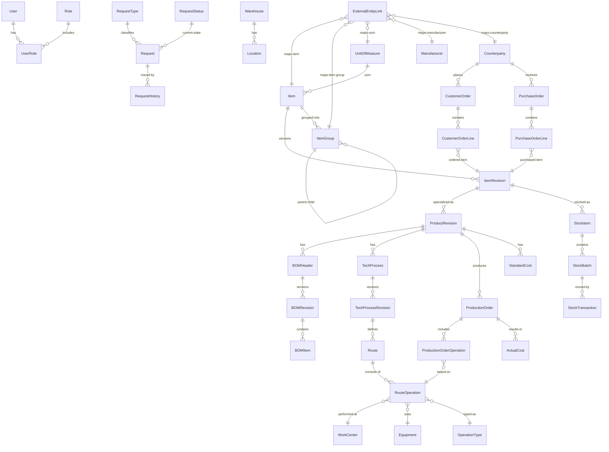

# MyIS — Общая концептуальная модель данных (v0.3)

> Документ объединяет концептуальную модель данных MyIS (v0.2) и уточнённую детализацию ключевых сущностей с полями (v0.3). Предназначен для архитекторов, разработчиков и ИИ-агентов (Kilo Code и др.), работающих с кодом MyIS.

---

## 1. Назначение документа

Документ определяет **целевую концептуальную модель данных** системы MyIS и базовый набор сущностей с полями. Используется для:

- проектирования архитектуры и слоёв (Domain / Application / Infrastructure / WebApi);
- проектирования модулей (PDM/Engineering, Technology, Requests, Warehouse и т.д.);
- согласования структуры БД и EF Core-моделей;
- настройки ИИ-агентов (например, Kilo Code) на работу по архитектуре MyIS;
- формирования требований для последующих ТЗ (Этапы 1+).

Документ описывает:

- домены и их схемы в PostgreSQL;
- сущности и связи на концептуальном уровне;
- ключевые поля основных сущностей;
- правила владения данными, версионности, измерений и статусов.

Этот документ **не является исчерпывающей физической схемой БД**, но служит эталоном для её построения и эволюции.

---

## 2. Архитектурные принципы модели данных

### 2.1. Одна БД, схемы по доменам

Используется одна БД PostgreSQL, например:

```text
Database: myis_db
```

Каждый домен данных хранит свои таблицы в **отдельной схеме** (для каркаса/Core используются несколько технических схем):

```text
core          – каркас: пользователи, роли, настройки, служебные таблицы (в т.ч. __EFMigrationsHistory)
org           – организация/HR: сотрудники (Employee)
mdm           – мастер-данные: номенклатура, ЕИ, поставщики/контрагенты, валюты, классификаторы
engineering   – изделия, BOM, КД, ревизии
technology    – ТП, маршруты, операции
warehouse     – склады, партии, остатки, движения
requests      – заявки, статусы, workflow-конфигурация
customers     – клиенты и их данные
production    – производственные заказы, WIP
procurement   – закупки, поставщики
costing       – себестоимость, трудозатраты
integration   – технические данные интеграций (подмодуль Core: Integration.Component2020)
```

### 2.2. Фиксированные домены

Целевой список доменов **фиксируется** и меняется только через правку концепции/архитектуры. Внутри доменов можно добавлять новые сущности, но:

- домены не объединяются;
- домены не дробятся на новые;
- логика владения сущностями остаётся стабильной.

На момент v0.3 в коде реализованы схемы: `core`, `org`, `mdm`, `requests`, `integration`. Остальные схемы в этом документе описаны как целевые (план).

### 2.3. Владелец данных

Каждая сущность имеет единственного **домен-владельца**. Только этот домен:

- создаёт/изменяет/удаляет записи;
- определяет бизнес-правила и политики.

Другие домены могут:

- ссылаться на сущность по ключам;
- читать данные через Application-слой;
- не нарушать инварианты чужого домена.

### 2.4. Идентификаторы

Базовое правило:

- `Guid Id` — суррогатный первичный ключ;
- при необходимости — дополнительный человекочитаемый `Code` (string).

### 2.5. Версионность

Версионность применяется для сущностей, связанных с жизненным циклом изделия и процессов:

- `ItemRevision` (план; в текущей реализации MDM используется `Item` без ревизий)
- `ProductRevision`
- `BOMRevision`
- `TechProcessRevision`

Общие принципы:

- ревизия неизменяема (кроме статуса);
- все изменения оформляются новой ревизией;
- статусы: `Draft`, `Approved`, `Released`, `Obsolete` (минимальный набор);
- у ревизии могут быть даты действия (EffectiveFrom / EffectiveTo).

### 2.6. Измерения и количество

Целевой вариант — VO для количества:

```csharp
public readonly record struct Quantity(
    decimal Value,
    Guid UnitOfMeasureId
);
```

В текущей реализации количество хранится как отдельные поля (например: `RequestLine.Quantity` + `RequestLine.UnitOfMeasureId`).

### 2.7. Статусы и workflow

Статусы не хранятся в виде «произвольных строк». Используются:

- справочники статусов (например, `RequestStatus`, `RevisionStatus`);
- enum/VO в коде для маппинга.

Переходы между статусами реализуются в Application-слое (use case / handler), а не в контроллерах или напрямую в EF.

### 2.8. Атрибуты (расширяемость)

Для расширения карточек номенклатуры используется механизм атрибутов в MDM:

- `mdm.ItemAttribute`
- `mdm.ItemAttributeValue`

Позволяет добавлять новые свойства без изменения структуры `mdm.items`. При необходимости может быть обобщён до универсального механизма для других доменов.

---

## 3. Домены и области ответственности

### 3.1. core

Схемы: `core`, `org`

Сущности:

- `User`, `Role`, `UserRole` (безопасность/доступ)
- `Employee` (HR‑контур, схема `org`, связь Employee ↔ User)
- (план) `Permission` / permission‑модель (сейчас используется policy‑based доступ)
- (план) `Document` (файлы)
- (план) универсальные атрибуты `AttributeDefinition`, `AttributeGroup`, `AttributeValue`, `ObjectAttributeValue`

Назначение: общесистемный каркас — безопасность/доступ, сотрудники, технические настройки и общие сервисы.

---

### 3.2. mdm (Master Data)

Схема: `mdm`

Сущности (реализация в репозитории + целевые):

- `Item` — номенклатура (компоненты, изделия, материалы, услуги)
- `ItemGroup` — дерево групп номенклатуры
- `UnitOfMeasure`, `Currency`
- `Counterparty`, `CounterpartyRole`, `CounterpartyExternalLink` — контрагенты и роли (`Supplier`/`Customer`)
- `Manufacturer`, `BodyType`
- `TechnicalParameter`, `ParameterSet`, `Symbol`
- `ItemAttribute`, `ItemAttributeValue` — атрибуты номенклатуры
- (план) `ItemRevision` — ревизии номенклатуры/изделия (для PDM/Engineering)

Назначение: единый источник правды по мастер‑данным (номенклатура, справочники, контрагенты и т.п.).

---

### 3.3. engineering (PDM / КД / BOM)

Схема: `engineering`

Сущности:

- `Product` — изделие (модель прибора/узла), часто 1:1 к Item для изделий
- `ProductRevision` — ревизия изделия (link к `mdm.ItemRevision` или отдельная сущность)
- `BOMHeader` — заголовок спецификации
- `BOMRevision` — ревизия спецификации
- `BOMItem` — строка спецификации
- `DesignDocument`, `DesignDocumentRevision`, связи с ProductRevision

Назначение: управление структурой изделий и конструкторской документацией.

---

### 3.4. technology (ТП/маршруты/операции)

Схема: `technology`

Сущности:

- `TechProcess`, `TechProcessRevision`
- `Route`, `RouteOperation`
- `OperationType`
- `WorkCenter`
- `Equipment`
- `TechDocument`, `TechDocumentRevision`

Назначение: ТП для приборостроения (монтаж, сборка, настройка, испытания), маршруты и операции.

---

### 3.5. warehouse (склад)

Схема: `warehouse`

Сущности:

- `Warehouse`
- `Location`
- `StockItem`
- `StockBatch`
- `StockTransaction`
- `InventoryDocument`, `InventoryLine`

Назначение: учёт остатков, партий, движений и инвентаризаций.

---

### 3.6. requests (заявки)

Схема: `requests`

Сущности:

- `Request`
- `RequestType`
- `RequestStatus`
- `RequestTransition` — конфигурация переходов workflow
- `RequestComment`
- `RequestAttachment`
- `RequestHistory`
- `RequestLine`

Назначение: единый каркас заявок и процессов (Этап 1 и далее).

---

### 3.7. customers

Схема: `customers`

Сущности:

- `Counterparty` (в `mdm`, роль `Customer`)
- `CustomerOrder`
- `CustomerOrderLine`

Назначение: клиенты и их заказы.

---

### 3.8. production

Схема: `production`

Сущности:

- `ProductionOrder`
- `ProductionOrderOperation`
- `WIPRecord`
- `ProductionBatch`

Назначение: производственные заказы и ход выполнения.

---

### 3.9. procurement

Схема: `procurement`

Сущности:

- `Counterparty` (в `mdm`, роль `Supplier`)
- `PurchaseOrder`
- `PurchaseOrderLine`
- `SupplierContract`

Назначение: закупки и поставщики.

---

### 3.10. costing

Схема: `costing`

Сущности:

- `CostElement`
- `StandardCost`
- `ActualCost`
- `LaborRate`
- `WorkTimeLog`

Назначение: расчёт себестоимости и учёт трудозатрат.

---

### 3.11. integration

Схема: `integration` (техническая схема каркаса `Core`, подмодуль `Integration.Component2020`)

Сущности (реализация в репозитории):

- `ExternalEntityLink` — универсальная таблица внешних ключей (привязки сущностей MyIS к записям внешних систем)
- `Component2020Connection` — параметры подключения к Access (Component-2020)
- `Component2020SyncCursor` — курсоры инкрементальной синхронизации
- `Component2020SyncRun` / `Component2020SyncError` — журнал прогонов синхронизации и ошибок
- `Component2020SyncSchedule` — расписание прогонов (текущая реализация упрощённая)

Назначение: технические данные интеграций и синхронизаций. Важно: мастер‑данные (справочники) хранятся в `mdm`; в `integration` — только технические таблицы интеграций/синхронизации. Детализированная структура доступов Компонент‑2020, которой следует придерживаться при проектировании этого домена, описана в [Component2020_Access_schema_mermaid.md](../.kilocode/rules/Component2020_Access_schema_mermaid.md).

---

## 4. Глобальная ER-диаграмма доменов (Mermaid)

> Диаграмма отражает целевую модель; в текущей реализации (v0.3) в коде присутствуют только часть доменов/сущностей (см. раздел 2.2 и `doc/02_Чек-лист_реализации.md`).



---

## 5. Детализация ключевых сущностей (v0.3)

Ниже приведена детализация основных сущностей с полями. Типы даны концептуально (C#-ориентированные). На физическом уровне они будут отображены в EF Core и PostgreSQL.

### 5.1. core

#### 5.1.1. `core.User`

| Поле         | Тип            | Обяз. | Описание |
|-------------|----------------|-------|----------|
| Id          | Guid           | ✔     | Идентификатор пользователя |
| Login       | string         | ✔     | Логин |
| PasswordHash| string         | ✔     | Хеш пароля |
| FullName    | string?        |       | Полное имя |
| EmployeeId  | Guid?          |       | Ссылка на `org.Employee` (если есть) |
| IsActive    | bool           | ✔     | Признак активности |
| CreatedAt   | DateTimeOffset | ✔     | Дата создания |
| UpdatedAt   | DateTimeOffset | ✔     | Дата изменения |

#### 5.1.2. `core.Role`

| Поле      | Тип    | Обяз. | Описание |
|----------|--------|-------|----------|
| Id       | Guid   | ✔     | Идентификатор роли |
| Code     | string | ✔     | Уникальный код (ADMIN, ENGINEER, …) |
| Name     | string | ✔     | Название |
| CreatedAt| DateTimeOffset | ✔ | Дата создания |

#### 5.1.3. `core.UserRole`

| Поле      | Тип            | Обяз. | Описание |
|----------|----------------|-------|----------|
| UserId   | Guid           | ✔     | Ссылка на `core.User` |
| RoleId   | Guid           | ✔     | Ссылка на `core.Role` |
| AssignedAt | DateTimeOffset | ✔   | Когда назначена роль |
| CreatedAt  | DateTimeOffset | ✔   | Дата создания записи |

#### 5.1.4. `org.Employee`

| Поле      | Тип            | Обяз. | Описание |
|----------|----------------|-------|----------|
| Id       | Guid           | ✔     | Идентификатор сотрудника |
| FullName | string         | ✔     | ФИО |
| Email    | string?        |       | E-mail |
| Phone    | string?        |       | Телефон |
| Notes    | string?        |       | Примечание |
| IsActive | bool           | ✔     | Признак активности |
| CreatedAt| DateTimeOffset | ✔     | Дата создания |
| UpdatedAt| DateTimeOffset | ✔     | Дата изменения |

---

### 5.2. mdm

#### 5.2.0. `mdm.UnitOfMeasure`

> В текущей реализации единицы измерения находятся в схеме `mdm` (см. `backend/src/Core.Infrastructure/Data/Configurations/Mdm/UnitOfMeasureConfiguration.cs`).

| Поле       | Тип    | Обяз. | Описание |
|-----------|--------|-------|----------|
| Id        | Guid   | ✔     | Идентификатор |
| Code      | string |       | Код (опционально) |
| Name      | string | ✔     | Название |
| Symbol    | string | ✔     | Обозначение |
| ExternalSystem | string? |  | Внешняя система (например, Component2020) |
| ExternalId | string? |  | Внешний ID |
| SyncedAt  | DateTimeOffset? |  | Время последней синхронизации |
| IsActive  | bool   | ✔     | Активность |
| CreatedAt | DateTimeOffset | ✔ | Дата создания |
| UpdatedAt | DateTimeOffset | ✔ | Дата изменения |

#### 5.2.0a. `mdm.Currency`

> В текущей реализации валюты находятся в схеме `mdm` (см. `backend/src/Core.Infrastructure/Data/Configurations/Mdm/CurrencyConfiguration.cs`).

| Поле       | Тип    | Обяз. | Описание |
|-----------|--------|-------|----------|
| Id        | Guid   | ✔     | Идентификатор |
| Code      | string? |      | Код (опционально) |
| Name      | string | ✔     | Название |
| Symbol    | string? |      | Обозначение |
| Rate      | decimal? |     | Курс (если ведётся) |
| ExternalSystem | string? |  | Внешняя система (например, Component2020) |
| ExternalId | string? |  | Внешний ID |
| SyncedAt  | DateTimeOffset? |  | Время последней синхронизации |
| IsActive  | bool   | ✔     | Активность |
| CreatedAt | DateTimeOffset | ✔ | Дата создания |
| UpdatedAt | DateTimeOffset | ✔ | Дата изменения |

#### 5.2.1. `mdm.Item`

| Поле       | Тип      | Обяз. | Описание |
|-----------|----------|-------|----------|
| Id        | Guid     | ✔     | Идентификатор |
| Code      | string   | ✔     | Код номенклатуры |
| Name      | string   | ✔     | Наименование |
| ItemKind  | enum     | ✔     | Тип/вид позиции (в коде: `ItemKind`) |
| UnitOfMeasureId | Guid | ✔   | Ссылка на `mdm.UnitOfMeasure` |
| IsActive  | bool     | ✔     | Признак активности |
| ItemGroupId | Guid?  |       | Группа номенклатуры (дерево `mdm.ItemGroup`) |
| IsEskd    | bool     | ✔     | Признак ЕСКД |
| IsEskdDocument | bool? |     | Признак ЕСКД-документа (если применимо) |
| ManufacturerPartNumber | string? | | MPN/артикул/PartNumber (если применимо) |
| ExternalSystem | string? |     | Внешняя система (например, Component2020) |
| ExternalId | string? |        | Внешний ID |
| SyncedAt  | DateTimeOffset? |  | Время последней синхронизации |
| CreatedAt | DateTimeOffset | ✔ | Дата создания |
| UpdatedAt | DateTimeOffset | ✔ | Дата изменения |

#### 5.2.1a. `mdm.ItemGroup`

> В текущей реализации группы — дерево (любой глубины) в таблице `mdm.item_groups` (см. `backend/src/Core.Infrastructure/Data/Configurations/Mdm/ItemGroupConfiguration.cs`).

| Поле      | Тип     | Обяз. | Описание |
|----------|---------|-------|----------|
| Id       | Guid    | ✔     | Идентификатор |
| Name     | string  | ✔     | Название |
| Abbreviation | string? |   | Аббревиатура (для корневых групп/категорий) |
| ParentId | Guid?   |       | Родительская группа |
| IsActive | bool    | ✔     | Активность |
| CreatedAt | DateTimeOffset | ✔ | Дата создания |
| UpdatedAt | DateTimeOffset | ✔ | Дата изменения |

#### 5.2.1b. `mdm.ItemAttribute`

| Поле      | Тип            | Обяз. | Описание |
|----------|----------------|-------|----------|
| Id       | Guid           | ✔     | Идентификатор |
| Code     | string         | ✔     | Уникальный код атрибута |
| Name     | string         | ✔     | Название |
| Type     | string         | ✔     | Тип (например: string/number/boolean) |
| IsActive | bool           | ✔     | Активность |
| CreatedAt | DateTimeOffset | ✔    | Дата создания |
| UpdatedAt | DateTimeOffset | ✔    | Дата изменения |

#### 5.2.1c. `mdm.ItemAttributeValue`

| Поле       | Тип            | Обяз. | Описание |
|-----------|----------------|-------|----------|
| ItemId     | Guid           | ✔     | Ссылка на `mdm.Item` |
| AttributeId| Guid           | ✔     | Ссылка на `mdm.ItemAttribute` |
| Value      | string         | ✔     | Значение (в виде строки) |
| CreatedAt  | DateTimeOffset | ✔     | Дата создания |
| UpdatedAt  | DateTimeOffset | ✔     | Дата изменения |

#### 5.2.1d. `mdm.Item` — расширения по доменам (план)

Карточка `Item` в UI строится как “шапка + вкладки по контекстам” (ECAD/MCAD/Закупка/Склад/…).
Чтобы не раздувать `mdm.items` десятками колонок, данные вкладок хранятся либо:

- в 1:1 таблицах‑расширениях (`mdm.item_ecad`, `mdm.item_mcad`, `mdm.item_procurement`, `mdm.item_storage`, …),
- либо в универсальном механизме атрибутов/параметров (наборы параметров + значения), применимость — через `ItemGroup`/категорию.

#### 5.2.2. `mdm.ItemRevision`

> Планируемая сущность (в текущем коде отсутствует).

| Поле           | Тип      | Обяз. | Описание |
|---------------|----------|-------|----------|
| Id            | Guid     | ✔     | Идентификатор ревизии |
| ItemId        | Guid     | ✔     | Ссылка на Item |
| RevisionCode  | string   | ✔     | Обозначение ревизии (A, B, 01…) |
| Status        | string   | ✔     | Статус (Draft, Approved, Released, Obsolete) |
| EffectiveFrom | DateTime |       | Дата начала действия |
| EffectiveTo   | DateTime?|       | Дата окончания действия |
| CreatedAt     | DateTime | ✔     | Дата создания |
| CreatedBy     | Guid     | ✔     | Автор |

---

### 5.3. engineering

#### 5.3.1. `engineering.Product`

| Поле   | Тип  | Обяз. | Описание |
|--------|------|-------|----------|
| Id     | Guid | ✔     | Идентификатор изделия |
| ItemId | Guid | ✔     | Ссылка на mdm.Item (для изделий типа FinishedProduct/Assembly) |

#### 5.3.2. `engineering.ProductRevision`

| Поле          | Тип    | Обяз. | Описание |
|---------------|--------|-------|----------|
| Id            | Guid   | ✔     | Идентификатор ревизии изделия |
| ProductId     | Guid   | ✔     | Ссылка на Product |
| ItemRevisionId| Guid   | ✔     | Связь с mdm.ItemRevision (если используется единая модель) |
| RevisionCode  | string | ✔     | Код ревизии |
| Status        | string | ✔     | Статус ревизии |
| CreatedAt     | DateTime | ✔   | Дата создания |
| CreatedBy     | Guid   | ✔     | Автор |

#### 5.3.3. `engineering.BOMHeader`

| Поле             | Тип    | Обяз. | Описание |
|------------------|--------|-------|----------|
| Id               | Guid   | ✔     | Идентификатор спецификации |
| ProductRevisionId| Guid   | ✔     | Ссылка на ProductRevision |
| Code             | string | ✔     | Код/обозначение спецификации |
| Name             | string | ✔     | Наименование |

#### 5.3.4. `engineering.BOMRevision`

| Поле        | Тип      | Обяз. | Описание |
|------------|----------|-------|----------|
| Id         | Guid     | ✔     | Идентификатор ревизии спецификации |
| BOMHeaderId| Guid     | ✔     | Ссылка на BOMHeader |
| RevisionCode | string | ✔     | Код ревизии |
| Status     | string   | ✔     | Статус |
| CreatedAt  | DateTime | ✔     | Дата создания |
| CreatedBy  | Guid     | ✔     | Автор |

#### 5.3.5. `engineering.BOMItem`

| Поле         | Тип      | Обяз. | Описание |
|-------------|----------|-------|----------|
| Id          | Guid     | ✔     | Идентификатор строки |
| BOMRevisionId | Guid   | ✔     | Ссылка на BOMRevision |
| ComponentItemRevisionId | Guid | ✔ | Ссылка на mdm.ItemRevision (компонент/узел) |
| QuantityValue | decimal| ✔     | Количество |
| QuantityUoMId | Guid   | ✔     | Единица измерения |
| IsOptional  | bool     |       | Необязательный компонент |
| Notes       | string   |       | Примечания |

---

### 5.4. technology

#### 5.4.1. `technology.TechProcess`

| Поле         | Тип  | Обяз. | Описание |
|--------------|------|-------|----------|
| Id           | Guid | ✔     | Идентификатор ТП |
| ProductRevisionId | Guid | ✔ | Ссылка на ProductRevision |

#### 5.4.2. `technology.TechProcessRevision`

| Поле          | Тип      | Обяз. | Описание |
|---------------|----------|-------|----------|
| Id            | Guid     | ✔     | Идентификатор ревизии ТП |
| TechProcessId | Guid     | ✔     | Ссылка на TechProcess |
| RevisionCode  | string   | ✔     | Код ревизии |
| Status        | string   | ✔     | Статус |
| CreatedAt     | DateTime | ✔     | Дата создания |
| CreatedBy     | Guid     | ✔     | Автор |

#### 5.4.3. `technology.Route`

| Поле                 | Тип      | Обяз. | Описание |
|----------------------|----------|-------|----------|
| Id                   | Guid     | ✔     | Идентификатор маршрута |
| TechProcessRevisionId| Guid     | ✔     | Ссылка на TechProcessRevision |
| Name                 | string   | ✔     | Наименование маршрута |

#### 5.4.4. `technology.RouteOperation`

| Поле           | Тип      | Обяз. | Описание |
|----------------|----------|-------|----------|
| Id             | Guid     | ✔     | Идентификатор операции в маршруте |
| RouteId        | Guid     | ✔     | Ссылка на Route |
| Sequence       | int      | ✔     | Порядковый номер |
| OperationTypeId| Guid     | ✔     | Тип операции |
| WorkCenterId   | Guid     | ✔     | Рабочее место |
| EquipmentId    | Guid?    |       | Оборудование (если фиксировано) |
| PlannedDurationMinutes | decimal |       | Плановое время, мин |

#### 5.4.5. `technology.WorkCenter`

| Поле      | Тип    | Обяз. | Описание |
|----------|--------|-------|----------|
| Id       | Guid   | ✔     | Идентификатор |
| Code     | string | ✔     | Код |
| Name     | string | ✔     | Наименование |
| DepartmentId | Guid? |     | Привязка к подразделению (core/Org) |

#### 5.4.6. `technology.Equipment`

| Поле      | Тип    | Обяз. | Описание |
|----------|--------|-------|----------|
| Id       | Guid   | ✔     | Идентификатор |
| Code     | string | ✔     | Инвентарный/заводской номер |
| Name     | string | ✔     | Наименование |
| WorkCenterId | Guid? |     | Основное место эксплуатации |

---

### 5.5. warehouse

#### 5.5.1. `warehouse.Warehouse`

| Поле  | Тип    | Обяз. | Описание |
|-------|--------|-------|----------|
| Id    | Guid   | ✔     | Идентификатор склада |
| Code  | string | ✔     | Код |
| Name  | string | ✔     | Название |

#### 5.5.2. `warehouse.Location`

| Поле        | Тип    | Обяз. | Описание |
|------------|--------|-------|----------|
| Id         | Guid   | ✔     | Идентификатор ячейки/зоны |
| WarehouseId| Guid   | ✔     | Ссылка на Warehouse |
| Code       | string | ✔     | Код (ряд/секция/ячейка) |
| Name       | string |       | Описание |

#### 5.5.3. `warehouse.StockItem`

| Поле          | Тип    | Обяз. | Описание |
|---------------|--------|-------|----------|
| Id            | Guid   | ✔     | Идентификатор записи по запасам |
| ItemRevisionId| Guid   | ✔     | Ссылка на mdm.ItemRevision |
| WarehouseId   | Guid   | ✔     | Ссылка на Warehouse |
| QuantityValue | decimal| ✔     | Количество |
| QuantityUoMId | Guid   | ✔     | UoM |

#### 5.5.4. `warehouse.StockBatch`

| Поле          | Тип    | Обяз. | Описание |
|---------------|--------|-------|----------|
| Id            | Guid   | ✔     | Идентификатор партии |
| StockItemId   | Guid   | ✔     | Ссылка на StockItem |
| BatchNumber   | string |       | Номер партии |
| SerialNumber  | string |       | Серийный номер (для штучных изделий) |
| ProductionDate| DateTime?|     | Дата производства |

---

### 5.6. requests

#### 5.6.1. `requests.Request`

| Поле         | Тип            | Обяз. | Описание |
|--------------|----------------|-------|----------|
| Id           | Guid           | ✔     | Идентификатор заявки |
| RequestTypeId| Guid           | ✔     | Ссылка на `requests.RequestType` |
| RequestStatusId | Guid        | ✔     | Ссылка на `requests.RequestStatus` |
| Title        | string         | ✔     | Заголовок |
| Description  | string?        |       | Описание |
| InitiatorId  | Guid           | ✔     | Инициатор (ссылка на `core.User`) |
| RelatedEntityType | string?    |       | Тип связанной сущности |
| RelatedEntityId   | Guid?      |       | Id связанной сущности |
| ExternalReferenceId | string?  |       | Внешняя ссылка/ID (если есть) |
| CreatedAt    | DateTimeOffset | ✔     | Дата создания |
| UpdatedAt    | DateTimeOffset | ✔     | Дата изменения |
| DueDate      | DateTimeOffset?|       | Желаемый срок |

#### 5.6.2. `requests.RequestType`

| Поле        | Тип    | Обяз. | Описание |
|------------|--------|-------|----------|
| Id         | Guid   | ✔     | Идентификатор |
| Code       | string | ✔     | Код (ECR, ECO, PURCH, …) |
| Name       | string | ✔     | Название |
| Description| string? |      | Описание |
| Direction  | enum   | ✔     | Направление (в коде: `RequestDirection`) |
| IsActive   | bool   | ✔     | Активность |

#### 5.6.3. `requests.RequestStatus`

| Поле        | Тип    | Обяз. | Описание |
|------------|--------|-------|----------|
| Id         | Guid   | ✔     | Идентификатор |
| Code       | string | ✔     | Код (NEW, IN_PROGRESS, …) |
| Name       | string | ✔     | Название |
| IsFinal    | bool   | ✔     | Финальный статус |
| Description| string? |      | Описание |
| IsActive   | bool   | ✔     | Активность |

#### 5.6.4. `requests.RequestTransition`

| Поле        | Тип    | Обяз. | Описание |
|------------|--------|-------|----------|
| Id         | Guid   | ✔     | Идентификатор |
| RequestTypeId | Guid | ✔   | Ссылка на `requests.RequestType` |
| FromStatusCode | string | ✔ | Код статуса-источника |
| ToStatusCode   | string | ✔ | Код статуса-назначения |
| ActionCode | string | ✔     | Код действия (Submit/Approve/…) |
| RequiredPermission | string? | | Требуемое право/permission (если используется) |
| IsEnabled  | bool   | ✔     | Включено |

#### 5.6.5. `requests.RequestLine`

| Поле        | Тип            | Обяз. | Описание |
|------------|----------------|-------|----------|
| Id         | Guid           | ✔     | Идентификатор |
| RequestId  | Guid           | ✔     | Ссылка на `requests.Request` |
| LineNo     | int            | ✔     | Номер строки |
| ItemId     | Guid?          |       | Ссылка на `mdm.Item` (если известна) |
| ExternalItemCode | string?   |       | Внешний код номенклатуры (если ItemId не задан) |
| Description| string?        |       | Описание позиции |
| Quantity   | decimal        | ✔     | Количество |
| UnitOfMeasureId | Guid?      |       | ЕИ (если применимо) |
| NeedByDate | DateTimeOffset?|       | Требуемая дата |
| SupplierName | string?       |       | Поставщик (текст) |
| SupplierContact | string?    |       | Контакт (текст) |
| ExternalRowReferenceId | string? |    | Внешняя ссылка/ID строки |

---

## 6. Связь с правилами проектирования кода MyIS

Для того, чтобы данная модель данных использовалась **и в документации, и ИИ-агентами (Kilo Code)**, необходимо:

1. **Положить данный файл в репозиторий**, например:  
   `doc/MyIS_Conceptual_Data_Model_v0.3.md`

2. В документе **«Правила проектирования кода MyIS»** добавить раздел:

   > ### Архитектура данных MyIS  
   > - Все новые сущности и изменения в моделях данных должны соответствовать документу `MyIS_Conceptual_Data_Model_v0.3.md`.  
   > - Домены, схемы и владение данными фиксированы. Добавление новой сущности должно сопровождаться указанием домена и схемы.  
   > - Запрещено создавать сущности и таблицы, дублирующие функциональность уже описанных в модели данных.  
   > - Любая новая бизнес-функция сначала описывается через существующие сущности (Item / ItemRevision / ProductRevision / BOM / TechProcess / Request и т.д.), а затем реализуется в коде.

3. В настройках **Kilo Code** (или другого ИИ-агента) использовать следующий фрагмент в системном/проектном промпте:

   > Ты работаешь в проекте MyIS (многослойная система для приборостроения).
   > Основой для всех моделей данных является документ `doc/MyIS_Conceptual_Data_Model_v0.3.md`.
   > - Всегда проверяй, к какой схеме относится новая сущность (`core`, `org`, `mdm`, `requests`, `integration`; остальные домены — по мере появления).
   > - Не изобретай свои сущности, если уже есть подходящие (например: `Item`, `UnitOfMeasure`, `Request`, `RequestLine`; `ItemRevision` — план).
   > - Соблюдай единые принципы: GUID Id, ревизии через *Revision (где применимо), количество через `Quantity`/поля + `UnitOfMeasureId`.
   > - Любые новые таблицы, классы сущностей и DTO должны быть совместимы с этой моделью.

4. При обсуждении новых модулей/ТЗ опираться на этот документ как на «истину по данным», а правила кодирования — как «истину по стилю и слоям».

---

Файл подготовлен для использования в проекте MyIS.
