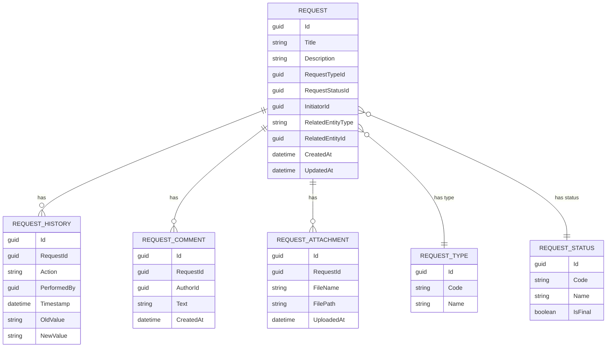

# Техническое задание  
## Этап 1 — Модуль Requests  
### Версия v1.1

---

# 1. Введение

## 1.1. Назначение документа
Настоящее техническое задание определяет требования к реализации модуля **Requests** (заявки) в составе информационной системы **MyIS** на Этапе 1.

Модуль Requests является универсальным механизмом регистрации, маршрутизации и обработки заявок различных типов, а также связующим инструментом между доменами MyIS — инженерией, производством, складом, закупками, логистикой и внешними системами.

## 1.2. Область применения
Настоящее ТЗ определяет требования к:
- backend‑модулю Requests;
- REST API для работы с заявками;
- фронтенд‑модулю Requests на основе общего AppShell;
- модели данных (схема `requests` в PostgreSQL);
- механизму согласований и жизненного цикла заявки;
- базовой интеграции с Компонент‑2020;
- реализацией ролевой модели доступа.

## 1.3. Определения
*(можно дополнить в финальной версии)*

---

# 2. Основания для разработки

Модуль Requests создаётся на основе следующих документов:
- **Концепция MyIS (Этап 0)** — определяет структуру системы, доменные границы, принципы модульного монолита.
- **Каркас системы MyIS (Этап 0)** — определяет backend‑ и frontend‑архитектуру, аутентификацию и авторизацию.
- **MyIS — Концептуальная модель данных (v0.3)** — определяет структуру доменных данных.
- **Бизнес‑процессы предприятия** — процессы разработки, изготовления, обеспечения, согласований и изменений.

---

# 3. Цели и задачи Этапа 1

## 3.1. Главная цель
Создать универсальный модуль, обеспечивающий:
- единый жизненный цикл заявок;
- согласование;
- хранение истории и комментариев;
- связь с объектами других доменов;
- базовую интеграцию с Компонент‑2020;
- соблюдение архитектурных принципов MyIS.

## 3.2. Основные задачи
1. Реализовать доменную модель `requests` согласно MyIS Data Model v0.3.
2. Реализовать CRUD заявки и справочников RequestType и RequestStatus.
3. Реализовать workflow и историю изменений.
4. Реализовать UI на базе AppShell.
5. Реализовать привязку заявок к объектам других доменов и внешним данным.
6. Реализовать просмотр, согласование и выполнение заявок.
7. Реализовать ролевую модель доступа.
8. Реализовать базовую интеграцию с Компонент‑2020 (чтение данных).

## 3.3. Ограничения
- Производственный контур, закупки, склад, инженерия — в будущих этапах.
- Интеграция с BPM — только задел.
- Компонент‑2020 — только чтение.

---

# 4. Функциональные требования

## 4.1. Модель данных Requests

Модель данных строится по MyIS Data Model v0.3 и включает сущности:

- **Request**
- **RequestType**
- **RequestStatus**
- **RequestWorkflow**
- **RequestHistory**
- **RequestComment**
- **RequestAttachment**

### Связи с внешними сущностями
Поддерживаются два механизма:

1. `RelatedEntityType + RelatedEntityId` — для сущностей, существующих в MyIS.
2. `integration.ExternalReference` — для объектов Компонент‑2020.

---

## 4.2. Типы заявок (Этап 1)
1. Заявка заказчика  
2. Внутренняя производственная заявка  
3. Заявка на обеспечение/закупку  
4. Заявка на внешний технологический этап  
5. Заявка на изменение (ECR/ECO‑light)  

Типы настраиваются через справочник.

---

## 4.3. Жизненный цикл и workflow

### Статусы:
- Draft  
- Submitted  
- InReview  
- Approved  
- Rejected  
- InWork  
- Done  
- Closed  

Переходы задаются сущностью RequestWorkflow.  
Генерируются события для дальнейшей интеграции с BPM.

---

## 4.4. Интерфейс пользователя

UI должен быть создан в AppShell и включать:

- Журнал заявок
- Форма создания/редактирования
- Карточка заявки
- Представления:
  - Мои заявки
  - На согласовании у меня
  - Все заявки

Компоненты: Ant Design 5, React 18, TypeScript, Vite.

---

## 4.5. Роли и доступ

| Роль | Права |
|------|--------|
| Initiator | Создание/редактирование, отправка на согласование |
| Approver | Согласование, отклонение |
| Executor | Выполнение заявок |
| Viewer | Просмотр |
| Admin | Настройка справочников, типов, workflow |

Роли используют модель core.users/roles.

---

## 4.6. Интеграция с Компонент‑2020

На Этапе 1 поддерживается:
- чтение заказов клиентов,
- чтение номенклатуры,
- привязка заявки к объектам Компонента через ExternalReference.

Данные Компонента не дублируются внутри MyIS.

---

# 5. Нефункциональные требования

## 5.1. Архитектура
- модульный монолит MyIS;
- .NET 8, Web API, EF Core 8, PostgreSQL;
- React 18, Typescript 5, Vite, Ant Design 5.

## 5.2. Производительность
- список заявок: ≤ 1 сек;
- карточка заявки: ≤ 2 сек;
- первичная загрузка UI: ≤ 3 сек.

## 5.3. Безопасность
- Авторизация через роли.
- История изменений фиксируется в RequestHistory.

## 5.4. Качество кода
Код должен соответствовать документу *«Правила проектирования кода MyIS»*.

---

# 6. Этапы выполнения

### Итерация 1 — Модель данных и базовые операции
### Итерация 2 — Workflow и согласование
### Итерация 3 — Связи с внешними объектами
### Итерация 4 — Интеграция с Компонент‑2020
### Итерация 5 — Завершение, тестирование, документация

---

# 7. Требования к документации
- ER‑диаграмма домена Requests (Mermaid);
- Swagger/OpenAPI;
- Руководство пользователя;
- Тест‑кейсы.

---

# ER-диаграмма Requests (Mermaid)

---
