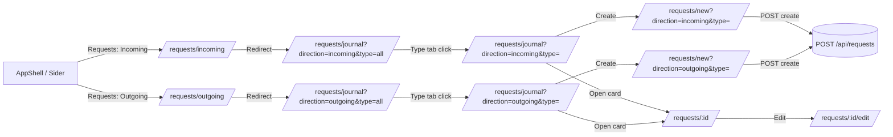

# Мини-ТЗ — Iteration 3.2: Incoming/Outgoing in Sider + Type Tabs in List (Requests)

Версия: v0.1  
Домен: `Requests`  
Фокус: навигация и создание заявок с выбором типа в форме (предвыбор из контекста списка при наличии).

---

## 1. Цель

Перестроить UX навигации модуля заявок так, чтобы путь пользователя был:

**Заявки → Входящие/Исходящие → (вкладка) Тип заявки → Создать**

и при создании заявки **тип можно выбирать в форме**, а контекст списка может предзадать значение.

---

## 2. Навигация и маршруты

### 2.1. Маршруты
Ввести (или закрепить) маршруты:

- `/requests/incoming` → redirect на `/requests/journal?direction=incoming&type=all`
- `/requests/outgoing` → redirect на `/requests/journal?direction=outgoing&type=all`
- `/requests/journal?direction=incoming&type=all`
- `/requests/journal?direction=outgoing&type=all`

Тип заявки фиксируется в URL (query) как `type=all|<requestTypeId>`, например:

- `/requests/journal?direction=incoming&type=all`
- `/requests/journal?direction=incoming&type=aaaaaaaa-aaaa-aaaa-aaaa-aaaaaaaaaaaa`
- `/requests/journal?direction=outgoing&type=aaaaaaaa-aaaa-aaaa-aaaa-aaaaaaaaaaaa`

Создание заявки:

- `/requests/new?direction=incoming&type=all`
- `/requests/new?direction=outgoing&type=aaaaaaaa-aaaa-aaaa-aaaa-aaaaaaaaaaaa`

Редактирование/просмотр остаются как есть (по id):

- `/requests/:id`
- `/requests/:id/edit`

> Примечание: допускается хранить выбранный тип и без query (в state), но **предпочтительно** фиксировать в URL для воспроизводимости и “shareable links”.

---

## 3. Левое меню (AppShell / Sider)

### 3.1. Требование
В левом меню модулей сделать `Requests` раскрывающимся пунктом (submenu) с подпунктами:

- **Incoming** → `/requests/incoming`
- **Outgoing** → `/requests/outgoing`

### 3.2. Активное состояние
Активный пункт меню определяется по маршруту (`/requests/incoming` или `/requests/outgoing`).

---

## 4. Страница списка заявок (RequestsListPage)

### 4.1. Поведение страницы
Одна страница `RequestsListPage` обслуживает оба направления (incoming/outgoing), определяя направление из URL:

- `direction = incoming|outgoing` (из path segment)

### 4.2. Вкладки по типам заявок
На странице показываются вкладки типов (Tabs), построенные из справочника `GET /api/request-types`.

- Первая вкладка: **All**
- Далее: вкладки для типов, которые относятся к выбранному направлению.

Ключ вкладки: `type.id` (Guid).

Заголовок вкладки: `type.name`.

Выбранная вкладка синхронизируется с URL:
- query `type=all|<requestTypeId>`

### 4.3. Фильтрация списка
- Если выбран `type=all`:
  - показывать заявки всех типов текущего направления.
- Если выбран конкретный `requestTypeId`:
  - показывать заявки только этого типа.

Реализация фильтра:
- backend умеет фильтровать по `direction` и `requestTypeId`.

---

## 5. Создание заявки (тип выбирается в форме)

### 5.1. Общий принцип
Кнопка «Создать заявку» отображается, если у пользователя есть права `Requests.Create`.  
Тип можно выбрать в форме; контекст `type` из URL, если есть, предзадаёт выбор.

### 5.2. Путь создания
При нажатии «Создать заявку» выполняется переход на:

- `/requests/new?direction={incoming|outgoing}&type={all|requestTypeId}`

### 5.3. Форма создания
`RequestEditPage` в режиме `new`:

- показывает поле выбора типа;
- если в query `type` передан `requestTypeId`, предвыбирает его;
- отправляет `CreateRequest` с выбранным `requestTypeId`.

---

## 6. Типо-зависимое тело заявки (Type Profiles)

Iteration 3.2 использует слой `Type Profiles` из Iteration 3:

- `SupplyRequestProfile` — обязателен
- `DefaultProfile` — fallback

Поведение:
- на списке вкладки формируются по типам из справочника;
- в форме/карточке тело рендерится по профилю.

---

## 7. Требования к backend (минимум)

### 7.1. DTO типов
`RequestTypeDto` должен содержать:
- `id: Guid`
- `name: string`

Желательно (для чистой фильтрации):
- `direction: Incoming|Outgoing`

### 7.2. CreateRequest API
`POST /api/requests` должен продолжать требовать `requestTypeId`.  
Тип выбирается в форме; query `type` используется как предвыбор (Guid) при наличии.

---

## 8. Тестирование (минимум)

### 8.1. Ручной чек-лист
1) В меню Requests видны Incoming/Outgoing и они ведут на соответствующие страницы.
2) На `/requests/incoming` видны вкладки типов входящих заявок.
3) Выбор вкладки меняет query `type=all|<requestTypeId>`.
4) Кнопка создания видна при наличии прав `Requests.Create`.
5) На нажатие кнопки переход на `/requests/new?direction=...&type=...`.
6) В форме создания тип выбирается вручную; при наличии query `type` предвыбор отрабатывает.
7) Созданная заявка появляется в списке выбранного типа.

---

## 9. Definition of Done

- Incoming/Outgoing вынесены в Sider меню как под-пункты Requests.
- На странице списка есть вкладки по типам (All + типы направления).
- Создание заявки возможно с выбором типа в форме; query `type` используется как предвыбор.
- URL отражает выбранное направление и тип (можно скопировать ссылку).

---

## 10. Mermaid — диаграмма маршрутов

---

## 11. Mermaid — диаграмма компонентов (список + создание)

