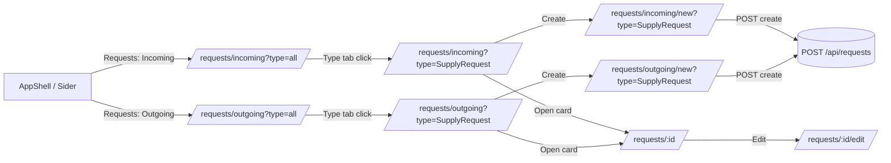

# Мини-ТЗ — Iteration 3.2: Incoming/Outgoing in Sider + Type Tabs in List (Requests)

Версия: v0.1  
Домен: `Requests`  
Фокус: навигация и создание заявок без выбора типа в форме (тип задаётся контекстом вкладки).

---

## 1. Цель

Перестроить UX навигации модуля заявок так, чтобы путь пользователя был:

**Заявки → Входящие/Исходящие → (вкладка) Тип заявки → Создать**

и при создании заявки **не требовалось** отдельного выбора типа в форме, т.к. тип уже определён выбранной вкладкой.

---

## 2. Навигация и маршруты

### 2.1. Маршруты
Ввести (или закрепить) маршруты:

- `/requests/incoming`
- `/requests/outgoing`

Тип заявки выбирается вкладкой на странице и фиксируется в URL (query), например:

- `/requests/incoming?type=all`
- `/requests/incoming?type=SupplyRequest`
- `/requests/outgoing?type=SupplyRequest`

Создание заявки в контексте типа:

- `/requests/incoming/new?type=SupplyRequest`
- `/requests/outgoing/new?type=SupplyRequest`

Редактирование/просмотр остаются как есть (по id):

- `/requests/:id`
- `/requests/:id/edit`

> Примечание: допускается хранить выбранный тип и без query (в state), но **предпочтительно** фиксировать в URL для воспроизводимости и “shareable links”.

---

## 3. Левое меню (AppShell / Sider)

### 3.1. Требование
В левом меню модулей сделать `Requests` раскрывающимся пунктом (submenu) с подпунктами:

- **Incoming** → `/requests/incoming`
- **Outgoing** → `/requests/outgoing`

### 3.2. Активное состояние
Активный пункт меню определяется по маршруту (`/requests/incoming` или `/requests/outgoing`).

---

## 4. Страница списка заявок (RequestsListPage)

### 4.1. Поведение страницы
Одна страница `RequestsListPage` обслуживает оба направления (incoming/outgoing), определяя направление из URL:

- `direction = incoming|outgoing` (из path segment)

### 4.2. Вкладки по типам заявок
На странице показываются вкладки типов (Tabs), построенные из справочника `GET /api/request-types`.

- Первая вкладка: **All**
- Далее: вкладки для типов, которые относятся к выбранному направлению.

Ключ вкладки: `type.code` (например `SupplyRequest`).

Заголовок вкладки: `type.name`.

Выбранная вкладка синхронизируется с URL:
- query `type=all|<typeCode>`

### 4.3. Фильтрация списка
- Если выбран `type=all`:
  - показывать заявки всех типов текущего направления.
- Если выбран конкретный `typeCode`:
  - показывать заявки только этого типа.

Реализация фильтра:
- Предпочтительно: backend умеет фильтровать по `direction` и `requestTypeId`.
- Минимально: фронт маппит `typeCode -> requestTypeId` и использует существующий параметр `requestTypeId` в `GET /api/requests`.

---

## 5. Создание заявки (без выбора типа)

### 5.1. Общий принцип
Кнопка «Создать заявку» отображается **только когда выбран конкретный тип**, а не `All`.

То есть:
- `/requests/incoming?type=all` → кнопки нет (или disabled с подсказкой «Выберите тип заявки»)
- `/requests/incoming?type=SupplyRequest` → кнопка есть

### 5.2. Путь создания
При нажатии «Создать заявку» выполняется переход на:

- `/requests/{direction}/new?type={typeCode}`

### 5.3. Форма создания
`RequestEditPage` в режиме `new`:

- **не показывает** поле выбора типа;
- устанавливает тип заявки из query `type`:
  - маппит `typeCode -> requestTypeId` по справочнику типов;
- отправляет `CreateRequest` с заполненным `requestTypeId`.

Если `type` отсутствует или равен `all` — показать ошибку/redirect на список с сообщением:
- «Для создания заявки выберите тип».

---

## 6. Типо-зависимое тело заявки (Type Profiles)

Iteration 3.2 использует слой `Type Profiles` из Iteration 3:

- `SupplyRequestProfile` — обязателен
- `DefaultProfile` — fallback

Поведение:
- на списке вкладки формируются по типам из справочника;
- в форме/карточке тело рендерится по профилю.

---

## 7. Требования к backend (минимум)

### 7.1. DTO типов
`RequestTypeDto` должен содержать:
- `id: Guid`
- `code: string`
- `name: string`

Желательно (для чистой фильтрации):
- `direction: Incoming|Outgoing`

### 7.2. CreateRequest API
`POST /api/requests` должен продолжать требовать `requestTypeId`.  
Тип определяется на фронте по `typeCode`, затем маппится в `requestTypeId`.

---

## 8. Тестирование (минимум)

### 8.1. Ручной чек-лист
1) В меню Requests видны Incoming/Outgoing и они ведут на соответствующие страницы.
2) На `/requests/incoming` видны вкладки типов входящих заявок.
3) Выбор вкладки меняет query `type=...`.
4) На `type=all` кнопка создания отсутствует/disabled.
5) На конкретном типе кнопка создания ведёт на `/requests/{direction}/new?type=TypeCode`.
6) В форме создания нет выбора типа, тип проставляется автоматически.
7) Созданная заявка появляется в списке выбранного типа.

---

## 9. Definition of Done

- Incoming/Outgoing вынесены в Sider меню как под-пункты Requests.
- На странице списка есть вкладки по типам (All + типы направления).
- Создание заявки возможно только из контекста конкретного типа.
- В форме создания отсутствует выбор типа; тип берётся из контекста вкладки.
- URL отражает выбранное направление и тип (можно скопировать ссылку).

---

## 10. Mermaid — диаграмма маршрутов



---

## 11. Mermaid — диаграмма компонентов (список + создание)

```mermaid
flowchart TB
  subgraph Shell[AppShell]
    SID[Sider Menu: Requests > Incoming/Outgoing]
    OUTLET[Outlet]
  end

  subgraph Pages[Pages]
    LIST[RequestsListPage(direction)]
    NEW[RequestEditPage(new)]
    CARD[RequestDetailsPage]
  end

  subgraph UI[UI Components]
    TABS[TypeTabs: All + Type tabs]
    TABLE[RequestListTable]
    BTN[Create button (enabled only if type != all)]
    BODY[RequestBodyRenderer (Type Profiles)]
    SUP[SupplyLinesEditor]
    DESC[DescriptionEditor]
  end

  subgraph API[API]
    TYPES[getRequestTypes()]
    REQS[getRequests(filters)]
    CREATE[createRequest(payload)]
    GETONE[getRequest(id)]
  end

  SID --> OUTLET
  OUTLET --> LIST
  OUTLET --> NEW
  OUTLET --> CARD

  LIST --> TYPES
  LIST --> TABS
  LIST --> REQS
  LIST --> TABLE
  LIST --> BTN

  BTN --> NEW
  NEW --> TYPES
  NEW --> BODY
  BODY --> SUP
  BODY --> DESC
  NEW --> CREATE

  TABLE --> CARD
  CARD --> GETONE
  CARD --> BODY
```
