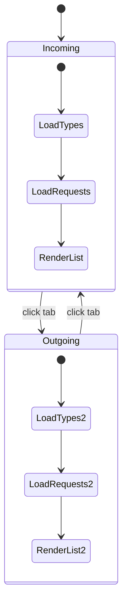

# ТЗ — Iteration 3: Type-based UI Tabs (Requests)

Версия: v0.1  
Домен: `Requests`  
Цель: реализовать разбиение UI по типам заявок (вкладки/формы/валидации), сохранив масштабируемость на десятки типов без переписывания страниц.

---

## 1. Цели и ожидаемый результат

### 1.1. Что делаем
1) **Список заявок**: вкладки (Tabs) для фильтрации по направлениям/типам.  
2) **Карточка заявки**: типо-зависимые вкладки тела заявки (Body).  
3) **Создание/редактирование**: динамическая форма тела заявки по выбранному типу.  
4) **Архитектура фронта**: реестр профилей типов (Type Profiles), чтобы добавление новых типов не требовало переписывать страницы.

### 1.2. Ключевой бизнес-кейс итерации
- `SupplyRequest` (заявка на обеспечение/закупку):
  - тело заявки = `Lines` (позиции) + `Description` (текст, трактуется как BodyText);
  - правило: **должно быть заполнено либо Lines (не пусто), либо Description**.

---

## 2. Scope / Not in scope

### 2.1. В scope
- UI вкладки в списке: минимум 2 вкладки **Incoming / Outgoing** (по `RequestType.Direction`), плюс опциональные вкладки по конкретным типам.
- Типо-зависимый рендер тела:
  - `SupplyRequest`: вкладка «Состав» + вкладка «Описание»;
  - другие типы: минимум вкладка «Описание».
- Реестр `RequestTypeProfile` на фронте.
- Минимальная синхронизация DTO: наличие стабильного поля `RequestType.Code` (и доступ к нему на фронте).

### 2.2. Не в scope
- Новый backend workflow, матрица переходов, права (если уже сделано в Этапе 2 — используем существующее).
- Вложения/файлы.
- Конфигурирование профилей типов из БД (в этой итерации профили кодируются на фронте).

---

## 3. Требования к backend (минимальные)

### 3.1. Контракты DTO
Нужно гарантировать, что фронт может определить тип заявки **по стабильному коду**, не по GUID.

Требование:
- `RequestTypeDto` содержит поле:
  - `code: string` (например `"SupplyRequest"`)
- `RequestDto` и `RequestListItemDto` должны предоставлять доступ к `type.code` **или** иметь плоское поле `requestTypeCode`.

Допустимые варианты:
- Вариант A (предпочтительно): `RequestDto.type.code`, `RequestListItemDto.type.code`
- Вариант B: `RequestDto.requestTypeCode`, `RequestListItemDto.requestTypeCode`

### 3.2. Фильтрация списка по направлению (опционально)
Если удобно, добавить query-параметр:
- `direction=Incoming|Outgoing`

Если backend не меняем — фронт получает список типов и маппит вкладки в `requestTypeId` фильтр.

---

## 4. Требования к frontend

### 4.1. Вкладки списка заявок (RequestsListPage)
Добавить Tabs:

- **Incoming**: показывает заявки типов, у которых `RequestType.Direction = Incoming`
- **Outgoing**: показывает заявки типов, у которых `RequestType.Direction = Outgoing`

Поведение:
- при переключении вкладки меняется фильтр (набор `requestTypeId`), затем выполняется загрузка списка.
- вкладка сохраняется в URL (желательно), например:
  - `/requests?tab=incoming`
  - `/requests?tab=outgoing`

Дополнительно (необязательно):
- подкладки/фильтр по конкретному типу внутри вкладки.

### 4.2. Типо-зависимый UI карточки (RequestDetailsPage)
Карточка имеет общую шапку (Header) и вкладки тела (Body).

Минимум:
- вкладки: **Details**, **History**, **Comments**
- в **Details** (или отдельной вкладке Body) — рендер по профилю:
  - `SupplyRequest`: 
    - вкладка/секция «Состав» (таблица Lines, только просмотр)
    - вкладка/секция «Описание» (Description)
  - прочие типы:
    - «Описание» (Description)

### 4.3. Типо-зависимый UI формы (RequestEditPage / RequestForm)
1) При создании:
   - пользователь выбирает `RequestType`
   - после выбора: форма перестраивается (рендер профиля)

2) При редактировании:
   - тип фиксирован, профиль выбирается по `request.type.code`

#### SupplyRequest (обязательный тип)
Поля:
- **Состав**:
  - таблица строк: добавить/удалить/изменить
  - минимум колонки: `Description/Item`, `Quantity`, `NeedByDate`, `SupplierName`, `SupplierContact`
- **Описание**:
  - многострочное поле `Description`

Валидация:
- `(Lines.Count > 0) OR (Description not empty)` — обязательно.
- числовые поля: quantity > 0.

#### Остальные типы (v0.1)
- показываем только `Description`, без Lines.

### 4.4. Реестр профилей типов (Type Profiles)
Создать слой расширения, чтобы новый тип добавлялся **без правки страниц**.

Рекомендуемая структура:
- `frontend/src/modules/requests/typeProfiles/`
  - `types.ts` — интерфейсы
  - `registry.ts` — маппинг `RequestTypeCode -> Profile`
  - `supplyRequest.profile.ts` — профиль SupplyRequest
  - `default.profile.ts` — fallback

Интерфейс (пример):
```ts
export type RequestTypeCode = string;

export interface RequestTypeProfile {
  code: RequestTypeCode;
  title: string;
  direction?: "Incoming" | "Outgoing";
  renderDetails: (ctx: DetailsContext) => React.ReactNode;
  renderEdit: (ctx: EditContext) => React.ReactNode;
  validate?: (model: RequestDraft) => ValidationError[];
}
```

Компоненты:
- `RequestBodyRenderer` — выбирает профиль и рендерит:
  - `renderDetails`
  - `renderEdit`

Fallback:
- Если код не найден в registry — использовать `default.profile.ts` (Description-only).

---

## 5. UI/UX требования

- Вкладки не должны разрастаться до 10+ на одном уровне:
  - верхний уровень: Incoming/Outgoing
  - внутри: фильтры/Select по типу
- Страница должна быть предсказуемой:
  - выбранная вкладка сохраняется при обновлении (URL или localStorage)
- Для SupplyRequest строки должны быть удобны:
  - «Добавить строку»
  - «Удалить строку»
  - inline-редактирование или модал (на усмотрение реализации)

---

## 6. Требования к тестированию (минимум)

### 6.1. Frontend unit/component tests (если есть инфраструктура)
- `RequestTypeProfileRegistry`:
  - возвращает SupplyRequest профиль по `"SupplyRequest"`
  - возвращает default профиль для неизвестного кода
- `SupplyRequest.validate`:
  - пустые Lines и пустой Description → ошибка
  - Lines>0 или Description заполнен → ок

### 6.2. Интеграционно (ручной чек-лист)
- Переключение вкладок Incoming/Outgoing меняет список.
- Создание SupplyRequest:
  - можно создать с Lines без Description
  - можно создать с Description без Lines
  - нельзя создать с пустым Lines и пустым Description
- В карточке SupplyRequest видны Lines и Description.

---

## 7. Критерии готовности (Definition of Done)

- На списке `/requests` есть вкладки Incoming/Outgoing.
- На `SupplyRequest` форма имеет секцию Lines + поле Description.
- Тип определяется по `RequestType.Code` (не по GUID).
- Реестр профилей типов существует, fallback реализован.
- Проходит сборка фронта (`npm run build`) и базовые тесты (если подключены).

---

## 8. Mermaid — схема UI компонентов (Type Profiles)

```mermaid
flowchart TB
  subgraph Pages[Pages]
    L[RequestsListPage]
    D[RequestDetailsPage]
    E[RequestEditPage]
  end

  subgraph API[API]
    RT[getRequestTypes()]
    RS[getRequestStatuses()]
    RQ[getRequests()]
    R1[getRequest(id)]
    RC[createRequest()]
    RU[updateRequest()]
  end

  subgraph Profiles[Type Profiles Layer]
    REG[RequestTypeProfileRegistry]
    SUP[SupplyRequestProfile]
    DEF[DefaultProfile]
    RBR[RequestBodyRenderer]
  end

  subgraph Components[UI Components]
    LIST[RequestListTable]
    FORM[RequestForm Shell]
    LINES[SupplyLinesEditor]
    DESC[DescriptionEditor]
    BODY[BodyTabs (Details/History/Comments)]
    HIST[HistoryTimeline]
    COMM[CommentsPanel]
  end

  L --> RT
  L --> RS
  L --> RQ
  L --> LIST

  E --> RT
  E --> RBR
  E --> FORM
  E --> RC
  E --> RU

  D --> R1
  D --> RBR
  D --> BODY
  D --> HIST
  D --> COMM

  RBR --> REG
  REG --> SUP
  REG --> DEF

  SUP --> LINES
  SUP --> DESC
  DEF --> DESC
```

---

## 9. Mermaid — схема вкладок списка (Incoming/Outgoing)


