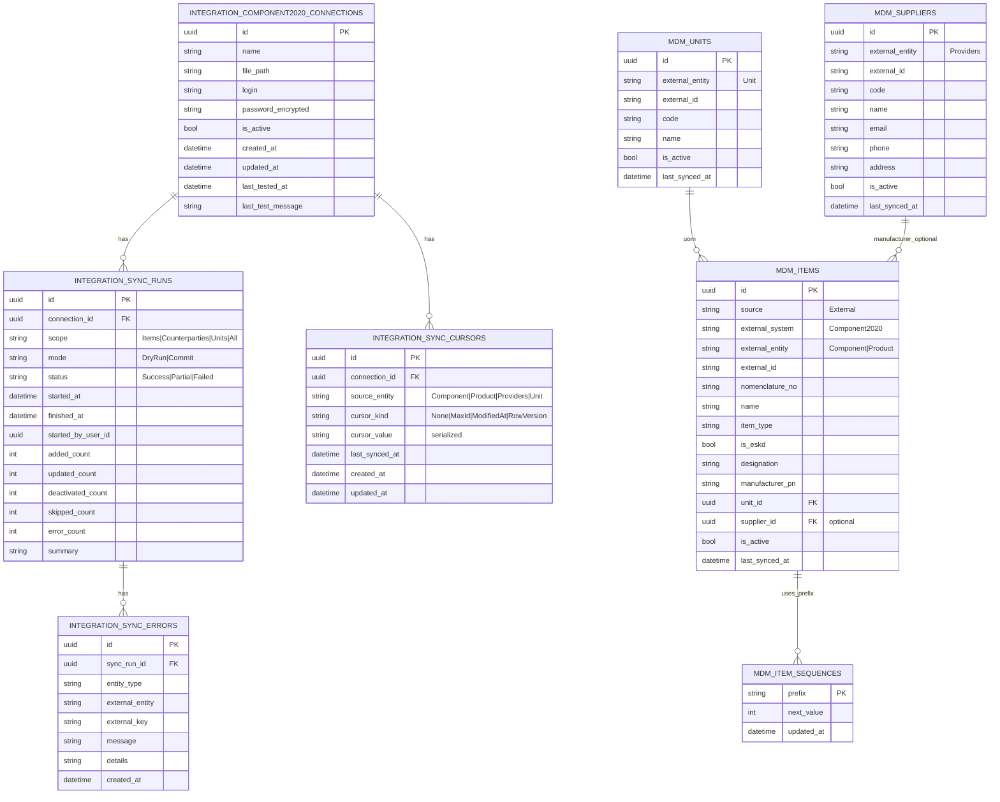
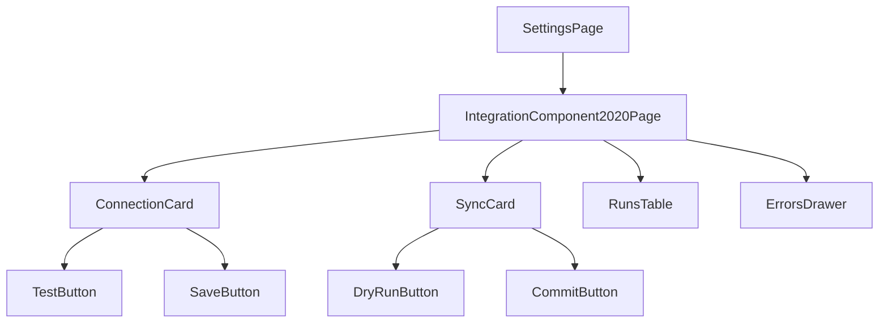

# ТЗ: Integration Component-2020 → MyIS (Implementation Spec v0.2)

**Цель:** реализовать интеграционный модуль для Microsoft Access **.mdb** (Component-2020) с периодическим зеркалированием справочников в MyIS (PostgreSQL), в режиме **ExternalMaster** для номенклатуры.

Документ объединяет пункты:
1) ER-диаграмма Integration Runtime (таблицы интеграции/логов/курсоров)  
2) ТЗ Iteration I1: Import Items + Counterparties + Units (read-only)  
3) ТЗ по миграциям: MDM Item + sequences + справочники + интеграционные таблицы  
4) ТЗ по Admin UI: Settings → Integration (Component-2020) + справочники (read-only)

Ссылочный документ с правилами данных/маппинга:
- `TZ_MDM_Item_Dictionaries_Integration_Component2020_v0.1.4.md`

---

## 0. Термины

- **ExternalMaster**: MyIS не создаёт/не редактирует номенклатуру (Item) на Iteration I1; позиции приходят только из Component-2020.
- **NomenclatureNo**: формат `XXX-000000` (см. MDM-ТЗ).
- **Designation**: ЕСКД-обозначение (для ЕСКД типов).
- **Dry-run**: прогон синка без записи в MyIS, с отчётом изменений.
- **Commit**: запись изменений в MyIS.
- **Cursor**: сохранённая точка инкрементальной синхронизации (таблица/механизм/значение).

---

## 1. Scope v0.2

### 1.1. Входит в реализацию (MUST)
- Подключение к Access `.mdb` с паролем (через OLEDB/ODBC).
- Admin UI:
  - настройка подключения;
  - проверка подключения;
  - запуск Dry-run;
  - запуск Commit sync;
  - просмотр истории запусков и ошибок.
- Инкрементальная синхронизация (upsert):
  - **Items**: объединение источников `Component` + `Product` → `mdm.items`
  - **Counterparties**: `Providers` → `mdm.counterparties` + роли (`mdm.counterparty_roles`) + внешние ключи (`mdm.counterparty_external_links`)
  - **Units**: `Unit` → `mdm.units`
- Логи и диагностика: `SyncRun`, `SyncError`, отчёт по изменениям.
- Миграции EF Core для таблиц `mdm.*` и `integration.*`.

### 1.2. Не входит (NOT NOW)
- Двусторонняя синхронизация (запись обратно в Component-2020).
- Сложные атрибуты Item (attribute-values) — можно добавить позже (сейчас MVP поля).
- Автоматический scheduler по cron (допустим ручной запуск из UI; планировщик — позже).
- Импорт CustomerOrder / PurchaseOrder / BOM / Tech routes.

---

## 2. ER-диаграмма (MyIS)

> Mermaid ER отражает целевые таблицы MyIS, не схему Access.



---

## 3. Таблицы и миграции (EF Core)

### 3.1. Схемы БД (MUST)
- `integration` — для подключения и синхронизации
- `mdm` — мастер-данные справочников

### 3.2. Миграции (MUST)

Создать миграции (или пакет миграций) для:
1) `integration.component2020_connections`
2) `integration.sync_cursors`
3) `integration.sync_runs`
4) `integration.sync_errors`
5) `mdm.item_sequences`
6) `mdm.units`
7) `mdm.counterparties` / `mdm.counterparty_roles` / `mdm.counterparty_external_links`
8) `mdm.items`

### 3.3. Индексы и уникальности (MUST)
- `mdm.items`:
  - unique `(external_entity, external_id)`
  - unique `nomenclature_no`
  - index `name` (ILIKE search)
  - index `manufacturer_pn` (опционально)
- `mdm.units`:
  - unique `(external_entity, external_id)`
  - unique `code` (если есть)
- `mdm.counterparty_external_links`:
  - unique `(external_system, external_entity, external_id)`
- `integration.sync_cursors`:
  - unique `(connection_id, source_entity)`
- `integration.sync_runs`:
  - index `(connection_id, started_at desc)`

### 3.4. Хранение секрета (MUST / Stage+Prod)
- `password_encrypted` хранить в зашифрованном виде (Data Protection / KMS / env-secret).
- В Dev допускается упрощённый вариант, но API **никогда** не возвращает пароль.

---

## 4. Инкрементальная синхронизация (алгоритм)

### 4.1. Общая схема (MUST)
Для каждого source_entity (`Component`, `Product`, `Providers`, `Unit`):

1) Загрузить `connection` (активную).
2) Открыть соединение к `.mdb`.
3) Определить `cursor` (из `integration.sync_cursors`).
4) Считать порцию изменённых строк из источника:
   - если есть `ModifiedAt`/`UpdatedAt` — использовать `ModifiedAt > cursor`.
   - иначе использовать `MaxId > cursor` (по ID, если оно монотонно).
   - если невозможно — fallback на полный импорт (но всё равно upsert).
5) Преобразовать во внутренние модели.
6) В Dry-run:
   - сравнить с текущими данными MyIS;
   - посчитать Added/Updated/Skipped/Errors;
   - записать `SyncRun` со статусом Success/Partial/Failed, **без изменений** в mdm.
7) В Commit:
   - выполнить upsert транзакционно;
   - soft-deactivate (если предусмотрено полным снимком; в инкрементальном режиме deactivate делается отдельной задачей/позже);
   - обновить cursor и last_synced_at.
8) Записать `SyncRun`, ошибки — в `SyncErrors`.

### 4.2. Upsert правила (MUST)
- Ключ совпадения: `(external_entity, external_id)`.
- Поля обновления:
  - `name`, `designation`, `manufacturer_pn`, `is_active`, `unit_id`, `supplier_id`, `last_synced_at`, etc.
- `nomenclature_no`:
  - для `Component` вычисляется детерминированно: `Prefix(ItemType) + "-" + Pad6(Component.Code)`.
  - для `Product` присваивается при первом появлении через `mdm.item_sequences`.
  - после присвоения `nomenclature_no` **не меняется** (см. MDM-ТЗ).

### 4.3. Управление последовательностями (MUST)
- При первой синхронизации:
  - инициализировать `mdm.item_sequences` для каждого Prefix: `max(существующий номер)+1`.
- При генерации:
  - транзакционная блокировка по Prefix (SELECT FOR UPDATE) или concurrency token.

---

## 5. Маппинг источников (ссылки на MDM-ТЗ)

### 5.1 Items (Component + Product)
- `Component` → `ItemType=PurchasedComponent`, `IsEskd=false`, `Designation=NULL`.
- `Product` → `IsEskd=true`, `Designation=Product.Name`, `Name=Product.Description`, `ItemType=Product` (MVP).

### 5.2 Counterparties (Providers)
- `Providers` → `mdm.counterparties` (ExternalMaster), роли `Supplier/Customer` через `mdm.counterparty_roles`
- минимальные поля:
  - `Name`, `INN`, `KPP`, `Email`, `Phone`, `Address/City/Site` (если доступны), `IsActive`.
  - внешний ключ: `Component2020:Providers:ID` хранится в `mdm.counterparty_external_links`.

### 5.3 Units (Unit)
- `Unit` → `mdm.units`:
  - `Code`, `Name`, `IsActive`.

> Детальные названия колонок берутся из `.kilocode/rules/Component2020_Access_schema_mermaid.md` (источник истины в этом репозитории).

---

## 6. API (WebApi)

### 6.1 Admin endpoints (MUST)

`/api/admin/integrations/component2020`

- `GET /connection` — получить текущую активную конфигурацию (без пароля).
- `POST /connection/test` — проверить подключение.
- `POST /connection/save` — сохранить/обновить конфиг (пароль передаётся только сюда).
- `POST /sync/dry-run` — dry-run по scope (`Items|Counterparties|Units|All`).
- `POST /sync/commit` — commit по scope.
- `GET /sync/runs?page=1&pageSize=20` — список запусков.
- `GET /sync/runs/{id}` — детальный отчёт (summary + counters).
- `GET /sync/runs/{id}/errors` — ошибки.

### 6.2 Авторизация (MUST)
- Все endpoints под политиками:
  - `Admin.Integration.View`
  - `Admin.Integration.Execute`

---

## 7. UI (Settings → Integration → Component-2020)

### 7.1 Экран подключения
- Поля:
  - FilePath
  - Password
  - Login (если требуется)
  - IsActive
- Кнопки:
  - Test
  - Save
- Индикация:
  - last tested at
  - last test message

### 7.2 Экран синхронизации
- Выбор scope:
  - Items / Counterparties / Units / All
- Кнопки:
  - Dry-run
  - Commit
- После выполнения:
  - показать counters (added/updated/skipped/errors)
  - если errors>0 — ссылка на список ошибок

### 7.3 История запусков
- Таблица SyncRuns:
  - started_at, mode, scope, status, counters
  - drill-down в детали

### 7.4 Ошибки
- Таблица SyncErrors:
  - entity_type, external_entity, external_key, message, created_at
  - фильтр по entity_type / external_entity

---

## 8. Job/Execution model (v0.2)

### 8.1 Реализация запуска (MUST)
В v0.2 допускается **запуск синка по запросу (HTTP)**:
- handler запускает синк и ждёт завершения;
- по окончании возвращает summary.

Ограничение:
- операция может быть длительной (для больших таблиц).
Решение:
- предусмотреть параметр `maxRows` или `batchSize`,
- а также timeouts на уровне сервера.

### 8.2 Переход на background job (SHOULD, v0.3)
В будущем:
- Hangfire/Quartz,
- асинхронные jobs,
- progress tracking.

---

## 9. Критерии приёмки (DoD)

### 9.1 Функциональные
- Можно сохранить параметры `.mdb` и проверить подключение.
- Dry-run по Items/Counterparties/Units возвращает корректные counters.
- Commit выполняет upsert и делает данные доступными в UI справочников.
- Логи SyncRuns и ошибки SyncErrors пишутся и отображаются в UI.

### 9.2 Нефункциональные
- Пароль не утечёт в логи/ответы API.
- Повторный commit не создаёт дубликатов (идемпотентность).
- При ошибке в одной записи синк:
  - либо продолжает с фиксацией ошибок (Partial),
  - либо прекращает (Failed) — **выбрать поведение**: по умолчанию Partial для справочников.

---

## 10. Mermaid: маршруты UI (Settings)

```mermaid
flowchart LR
  A[AppShell] --> S[Settings]
  S --> I[Integration]
  I --> C[Component-2020]
  C --> C1[Connection Form]
  C --> C2[Sync Panel]
  C --> C3[Runs History]
  C --> C4[Errors]

  S --> D[Dictionaries]
  D --> D1[Items (read-only)]
  D --> D2[Counterparties (read-only)]
  D --> D3[Units (read-only)]
```

---

## 11. Mermaid: компоненты фронтенда (минимально)



---

## 12. Примечания по реализации Access (важно)

- Для Access `.mdb` требуется драйвер:
  - Microsoft Access Database Engine (ACE OLEDB) или ODBC.
- Ошибки “драйвер не установлен / неверный пароль / файл не найден” должны быть:
  - понятными для пользователя,
  - записаны в `last_test_message` и/или `SyncErrors`.

---

## 13. Открытые решения (требуют фиксации перед кодом)

1) Поведение при ошибках отдельных строк:
   - **Partial** (продолжать) или **Failed** (останавливать).
   - Рекомендация для справочников: **Partial**, чтобы импорт не стопорился из-за 1 записи.
2) Deactivate стратегия:
   - в инкрементальном режиме deactivate можно делать:
     - отдельной кнопкой “Full snapshot” (позже), или
     - не делать на v0.2 (только upsert active).
   - Для v0.2: **не деактивировать массово**, только обновлять `IsActive` если поле есть и приходит из источника.
