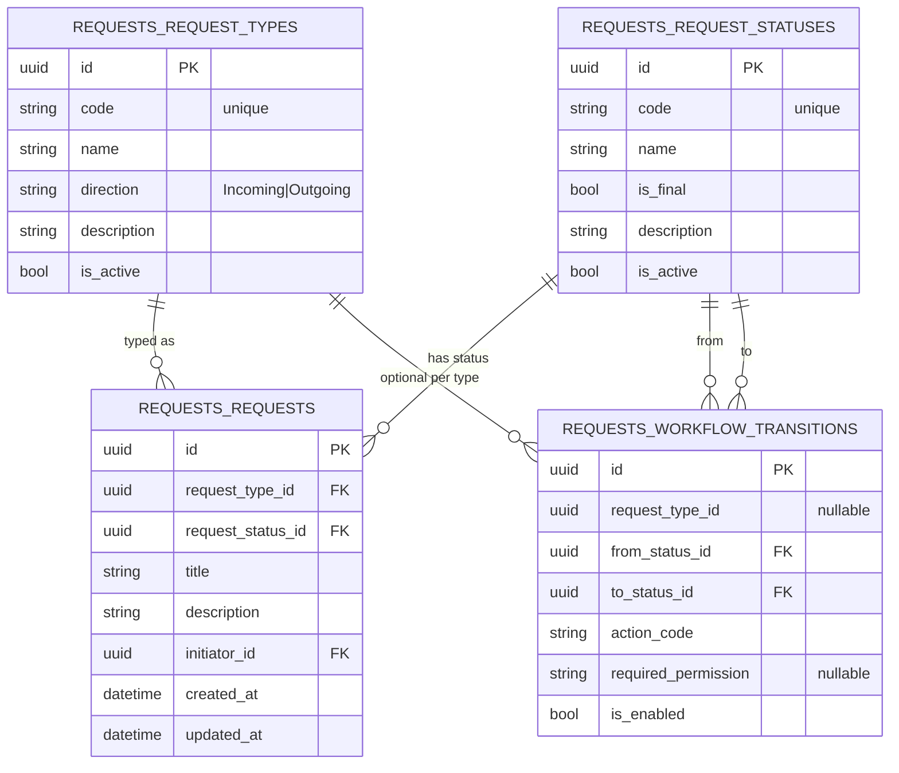
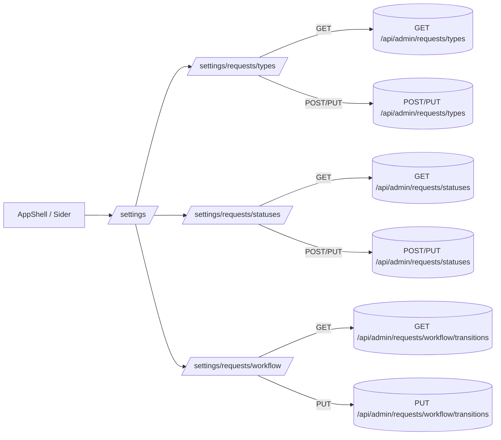

# ТЗ — Iteration S1: Settings Module (Requests Dictionaries)

Версия: v0.1  
Домен(ы): `Requests`, `Core` (права), UI-модуль `Settings`  
Цель: добавить административный модуль **Settings** для ведения справочников Requests и настройки workflow через UI, с контролем прав.

---

## 1. Контекст и мотивация

Справочники Requests (типы, статусы, переходы workflow) должны управляться **через единый модуль Settings**, а не через “разрозненные экраны” в каждом домене.  
При этом сами данные остаются **в домене Requests** (схема `requests`), Settings — это **админская оболочка** (UI + admin endpoints), не новый предметный домен.

---

## 2. Scope / Not in scope

### 2.1. В scope (S1)
1) **Frontend**
- Новый пункт меню **Settings** в левом Sider.
- Раздел: **Settings → Requests**
  - Types (Request Types)
  - Statuses (Request Statuses)
  - Workflow (Transitions / Matrix)

2) **Backend**
- Admin API для CRUD справочников Requests и редактирования переходов workflow.
- Проверка прав (минимальная, но реальная): доступ только для пользователей с нужными permission’ами/ролями.

3) **Миграции/данные**
- Ничего не “сидировать” в UI: UI только управляет справочниками.
- Начальные данные могут быть в миграциях (если уже есть) — UI должен работать поверх них.

### 2.2. Не в scope (S1)
- Настройка пользователей/ролей/permissions UI (можно позже).
- Вложения/файлы, email-рассылки, интеграции.
- Версионирование справочников и audit trail “по объектам” (можно позже).
- Конфигурирование “каких полей показывать” (dynamic forms) — позже.

---

## 3. Данные и модель (что редактируем)

В S1 редактируются сущности Requests:

- `RequestType` (справочник типов)
- `RequestStatus` (справочник статусов)
- `RequestWorkflowTransition` (переходы/матрица)

> Примечание: если у вас Transition уже выражен через таблицу/сущность — используем существующую модель. Если нет — добавляем минимальную сущность уровня Infrastructure/Application для управления переходами.

---

## 4. Требования к backend

### 4.1. Admin API (контракты)
Все эндпоинты под префиксом:  
`/api/admin/requests/...`

#### 4.1.1. Types
- `GET /api/admin/requests/types`
  - возвращает список типов
- `POST /api/admin/requests/types`
  - создать тип
- `PUT /api/admin/requests/types/{id}`
  - обновить тип
- `POST /api/admin/requests/types/{id}/archive` (опционально)
  - “архивировать/деактивировать” тип (предпочтительно вместо удаления)

Поля типа (минимум):
- `code` (string, уникальный, стабильный ключ для UI/логики)
- `name`
- `description` (optional)
- `direction` (Incoming/Outgoing) — если уже используется в UI
- `isActive` (bool) — опционально, но рекомендуется

Валидации:
- `code` обязателен, `A-Za-z0-9._-` (без пробелов), уникален.
- `name` обязателен.
- Запрет “удаления” если тип используется в заявках (вместо delete — archive).

#### 4.1.2. Statuses
- `GET /api/admin/requests/statuses`
- `POST /api/admin/requests/statuses`
- `PUT /api/admin/requests/statuses/{id}`
- `POST /api/admin/requests/statuses/{id}/archive` (опционально)

Поля статуса (минимум):
- `code` (RequestStatusCode или string)
- `name`
- `description` (optional)
- `isFinal` (bool)
- `isActive` (bool) — опционально

Валидации:
- `code` обязателен, уникален.
- Запрет изменения `code` после использования (рекомендуется: immutable).

#### 4.1.3. Workflow / Transitions
- `GET /api/admin/requests/workflow/transitions?typeCode={code|optional}`
  - если `typeCode` не задан — общая матрица (для всех типов)
  - если задан — матрица для конкретного типа (если поддерживается)
- `PUT /api/admin/requests/workflow/transitions`
  - bulk upsert/replace списка переходов
  - рекомендуется: идемпотентная операция

Поля перехода (минимум):
- `fromStatusId`
- `toStatusId`
- `actionCode` (например `Submit`, `StartReview`, `Approve`, `Reject`, `Close`)
- `requiredPermission` (например `Requests.Workflow.Approve`) — опционально в S1, но желательно
- `isEnabled` (bool)

Валидации:
- `fromStatusId != toStatusId`
- уникальность `(fromStatusId, toStatusId, actionCode, typeId?)`
- запрет удаления переходов, если они используются историей (опционально) — обычно можно, но осторожно.

### 4.2. Права доступа (минимум)
Доступ к Settings разделам должен быть ограничен.

Минимальные permission’ы:
- `Admin.Settings.Access`
- `Admin.Requests.EditTypes`
- `Admin.Requests.EditStatuses`
- `Admin.Requests.EditWorkflow`

Правило:
- **Backend — источник истины**. Даже если фронт “скрыл кнопку”, API должен запретить.

---

## 5. Требования к frontend

### 5.1. Навигация (Sider)
Добавить пункт меню:

- **Settings**
  - **Requests**
    - Types → `/settings/requests/types`
    - Statuses → `/settings/requests/statuses`
    - Workflow → `/settings/requests/workflow`

> Можно сделать `/settings` приватным маршрутом внутри существующих guard’ов (DbStatusGuard + RequireAuth).

### 5.2. Pages
#### 5.2.1. TypesPage
- Таблица типов + действия:
  - Create
  - Edit
  - Archive/Deactivate
- Форма:
  - Code, Name, Direction, Description, IsActive

#### 5.2.2. StatusesPage
- Таблица статусов + действия:
  - Create
  - Edit
  - Archive/Deactivate
- Форма:
  - Code, Name, IsFinal, Description, IsActive

#### 5.2.3. WorkflowPage
UI вариант (S1, простой и быстрый):
- Список переходов (table) с фильтрами:
  - FromStatus, ToStatus, ActionCode
- Действия:
  - Add transition
  - Edit transition
  - Disable/Enable
- Опционально: bulk edit (вставка списка)

> “Красивая матрица” (grid From×To) можно позже, сейчас — таблица.

### 5.3. Взаимодействие с правами
Фронт использует `useCan(...)` (или аналог), чтобы скрывать/блокировать действия:
- без `Admin.Settings.Access` → скрыть весь модуль Settings (или показать 403 страницу)
- без `Admin.Requests.EditTypes` → TypesPage read-only
- аналогично для Statuses/Workflow

---

## 6. Ошибки и UX
- Если backend возвращает 403 — показывать понятное сообщение “Недостаточно прав”.
- Валидационные ошибки — выводить рядом с полями.
- Для операций Archive/Disable — подтверждение (Modal confirm).

---

## 7. Тестирование

### 7.1. Backend (минимум)
- Integration tests:
  - 401 без auth
  - 403 без permission
  - 200/201/204 при наличии permission
- Unit tests (по желанию):
  - валидация code уникальности (если вынесено в домен/use-case)

### 7.2. Frontend (минимум)
- Smoke test:
  - роуты открываются
  - таблицы грузятся
  - create/edit работает для админа
- (Опционально) компонентные тесты форм.

---

## 8. Definition of Done
- В Sider есть Settings → Requests → Types/Statuses/Workflow.
- Реализованы admin endpoints и они защищены permission’ами.
- UI позволяет создавать/редактировать/архивировать типы и статусы.
- UI позволяет управлять переходами workflow (минимум enable/disable + add/edit).
- Сборка и тесты проходят (`dotnet test`, `npm run build`).

---

## 9. ER (Mermaid) — что редактируем

---

## 10. Mermaid — маршруты UI

