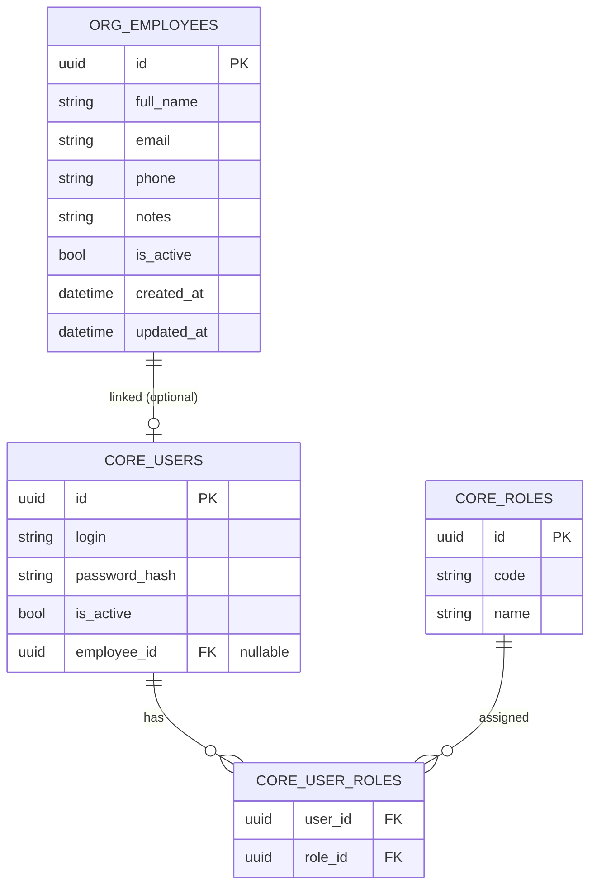

# ТЗ — Iteration S2: Settings → Security (Employees + Users + Roles)

Версия: v0.1  
Цель: добавить в модуль **Settings** раздел **Security**, чтобы вести сотрудников (карточки), пользователей (учётки доступа) и роли (назначение ролей пользователям).  
Принцип: **Сотрудник (Employee) ≠ Пользователь (User)**. Не все сотрудники имеют доступ в систему.

---

## 1. Термины и правила

### 1.1. Термины
- **Employee (Сотрудник)**: реальный человек в организации (карточка, контакты, подразделение).
- **User (Пользователь)**: учётная запись для входа в MyIS (логин/пароль/активность).
- **Role (Роль)**: набор прав для выполнения функций в системе (RBAC).

### 1.2. Правила (обязательно)
- Не каждый `Employee` имеет `User`.
- Каждый `User` должен быть связан с `Employee`, кроме специальных тех. учёток (если будут) — в S2 не вводим.
- Один `User` может иметь **несколько ролей** (через `UserRole`).
- Назначения “начальник участка/ответственный” в S2 **не реализуем** (это отдельная итерация Organization/Responsibilities), но модель должна не мешать расширению.

---

## 2. Scope / Not in scope

### 2.1. In scope (S2)
- Settings → Security:
  - Employees (CRUD + deactivate)
  - Users (CRUD + deactivate + reset password)
  - Roles (CRUD ограниченно: create/update, без удаления; список)
  - Assign roles to users (grant/revoke)
  - Bind User ↔ Employee (выбор сотрудника для учётки)

### 2.2. Not in scope (S2)
- Permission-таблицы и UI управления permissions (пока права через policies/roles mapping).
- Оргструктура, должности, зоны ответственности (будет отдельный модуль/итерация).
- Audit trail/журнал админских изменений (можно позже).

---

## 3. Модель данных

### 3.1. Схемы
- `core` — остаются пользователи/роли (существует).
- `org` — новая схема для сотрудников.

### 3.2. Новые таблицы
#### 3.2.1. org.employees
Поля (минимум):
- `id` UUID PK
- `full_name` string (required)
- `email` string (nullable)
- `phone` string (nullable)
- `notes` string (nullable)
- `is_active` bool (default true)
- `created_at` timestamp
- `updated_at` timestamp

#### 3.2.2. core.users: связь с сотрудником
Добавить поле:
- `employee_id` UUID nullable FK → `org.employees.id`

> Рекомендация: на старте nullable (чтобы миграция не ломала существующие данные). После заполнения можно ужесточить до NOT NULL.

### 3.3. Ограничения
- Один `Employee` может быть привязан к 0..1 `User`.  
  Реализация: unique index на `core.users.employee_id` WHERE employee_id IS NOT NULL.
- Удаление `Employee` запрещено, если есть привязанный `User` → используем deactivate.
- Удаление `Role` запрещено, если она назначена → лучше `is_active` (опционально) либо запрет delete.

---

## 4. Backend: Admin API

Префикс: `/api/admin/security/...`

### 4.1. Employees
- `GET /api/admin/security/employees?search=...&isActive=...`
- `GET /api/admin/security/employees/{id}`
- `POST /api/admin/security/employees`
- `PUT /api/admin/security/employees/{id}`
- `POST /api/admin/security/employees/{id}/deactivate`
- `POST /api/admin/security/employees/{id}/activate`

### 4.2. Users
- `GET /api/admin/security/users?search=...&isActive=...`
- `GET /api/admin/security/users/{id}`
- `POST /api/admin/security/users`
- `PUT /api/admin/security/users/{id}`
- `POST /api/admin/security/users/{id}/deactivate`
- `POST /api/admin/security/users/{id}/activate`
- `POST /api/admin/security/users/{id}/reset-password`

User fields:
- `login` (unique)
- `isActive`
- `employeeId` (nullable)
- (опционально) `employeeFullName` в ответе

Reset password:
- вход: `{ newPassword }` (S2: админ задаёт пароль вручную, backend хеширует)

### 4.3. Roles
- `GET /api/admin/security/roles`
- `POST /api/admin/security/roles` (опционально)
- `PUT /api/admin/security/roles/{id}`

> Если роли пока фиксированы — оставить только `GET`.

### 4.4. Назначение ролей пользователю
- `GET /api/admin/security/users/{id}/roles`
- `PUT /api/admin/security/users/{id}/roles`
  - вход: список `roleIds` или `roleCodes`
  - операция идемпотентная: “установить ровно этот набор”

---

## 5. Права доступа (policies, без permissions-таблиц)

Минимальные permission strings (policies):
- `Admin.Settings.Access`
- `Admin.Security.View`
- `Admin.Security.EditEmployees`
- `Admin.Security.EditUsers`
- `Admin.Security.EditRoles`

Маппинг на роли (на текущем этапе):
- роль `ADMIN` даёт все `Admin.*`

---

## 6. Frontend: Settings → Security UI

### 6.1. Навигация
Добавить в Sider:
- Settings
  - Requests (как в S1)
  - Security
    - Employees → `/settings/security/employees`
    - Users → `/settings/security/users`
    - Roles → `/settings/security/roles`

### 6.2. Employees page
- Таблица: FullName, Email, Phone, Active
- Действия: Create/Edit, Activate/Deactivate
- Поиск: по ФИО/контактам

### 6.3. Users page
- Таблица: Login, Employee (FullName), Roles, Active
- Действия: Create/Edit, Activate/Deactivate, Reset password, Manage roles, Bind Employee

### 6.4. Roles page
- Таблица: Code, Name
- Действия: Create/Edit (если разрешено) либо read-only

---

## 7. Тестирование (минимум)

- Backend: 401/403, CRUD, unique employeeId.
- Frontend: smoke (роуты, таблицы, формы, назначение ролей).

---

## 8. Definition of Done
- Settings → Security (Employees/Users/Roles) доступен и защищён.
- Есть `org.employees` и `core.users.employee_id`.
- Можно привязать user→employee и назначить несколько ролей пользователю.
- Есть reset password.

---

## 9. ER (Mermaid)



---

## 10. Mermaid — маршруты UI

```mermaid
flowchart LR
  SID[AppShell / Sider] --> S[/settings/]
  S --> E[/settings/security/employees/]
  S --> U[/settings/security/users/]
  S --> R[/settings/security/roles/]

  E -->|GET| AE[(GET /api/admin/security/employees)]
  E -->|POST/PUT| AE2[(POST/PUT /api/admin/security/employees)]
  E -->|activate/deactivate| AE3[(POST /employees/{id}/activate|deactivate)]

  U -->|GET| AU[(GET /api/admin/security/users)]
  U -->|POST/PUT| AU2[(POST/PUT /api/admin/security/users)]
  U -->|roles| AU3[(GET/PUT /users/{id}/roles)]
  U -->|reset pw| AU4[(POST /users/{id}/reset-password)]

  R -->|GET| AR[(GET /api/admin/security/roles)]
  R -->|POST/PUT| AR2[(POST/PUT /api/admin/security/roles)]
```
